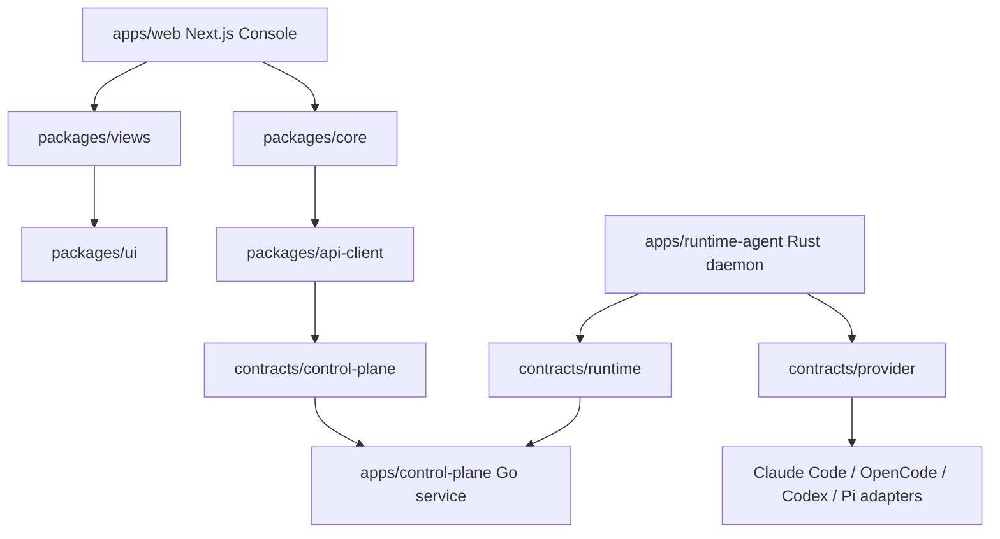

# SuperTeam 当前分层流向

展示 Web Console、Control Plane、Runtime Agent、Provider 和共享契约的主要依赖与调用边界。

## Sources

- .claude/worktrees/control-plane-api/README.md
- .claude/worktrees/control-plane-api/contracts/control-plane/README.md
- .claude/worktrees/control-plane-api/contracts/runtime/README.md
- .claude/worktrees/control-plane-api/contracts/provider/README.md
- .claude/worktrees/control-plane-api/apps/web/package.json

