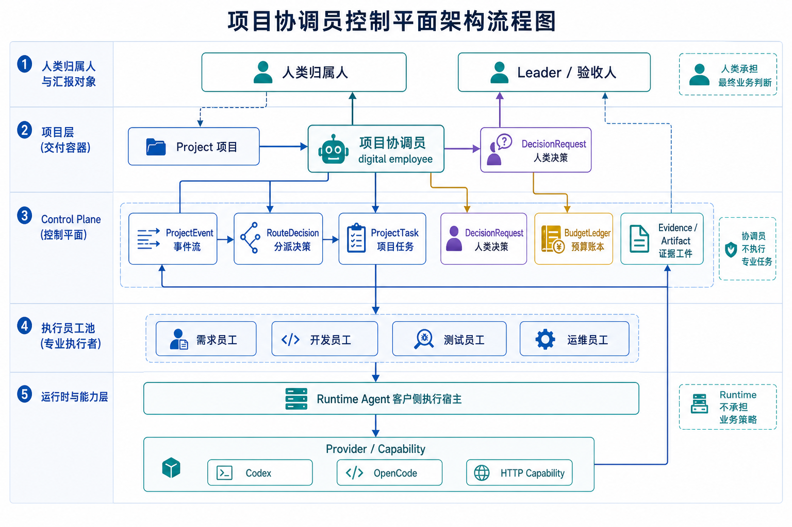
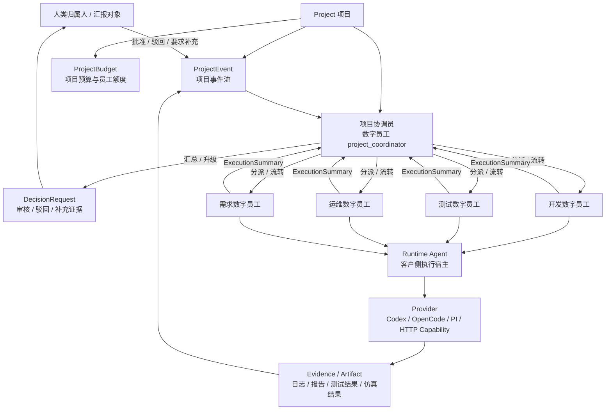
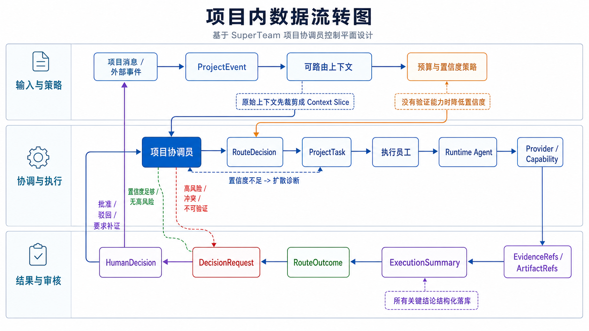
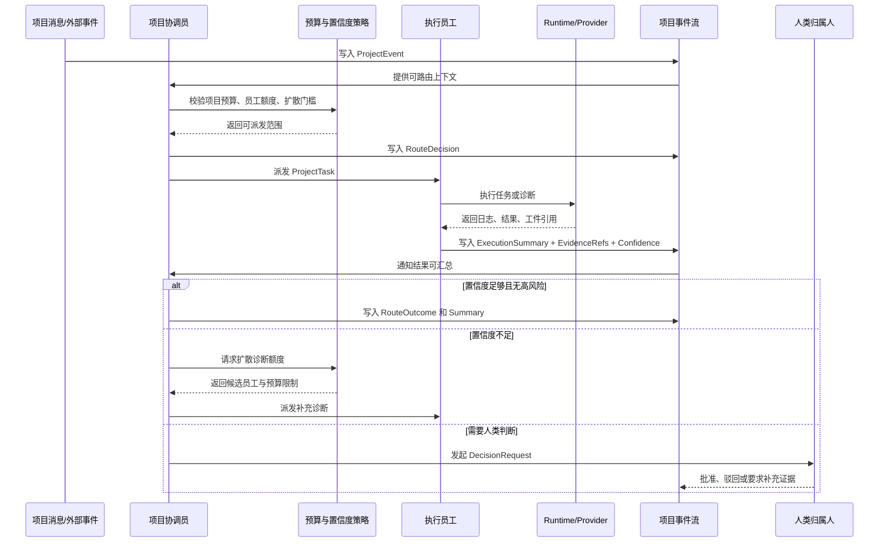
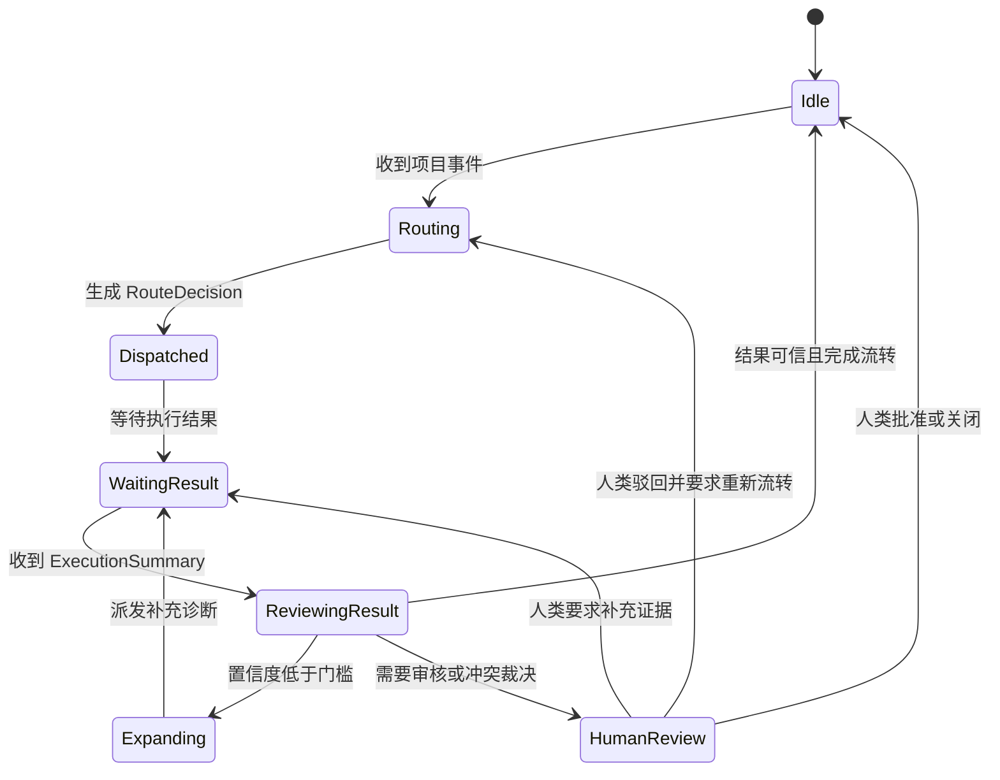
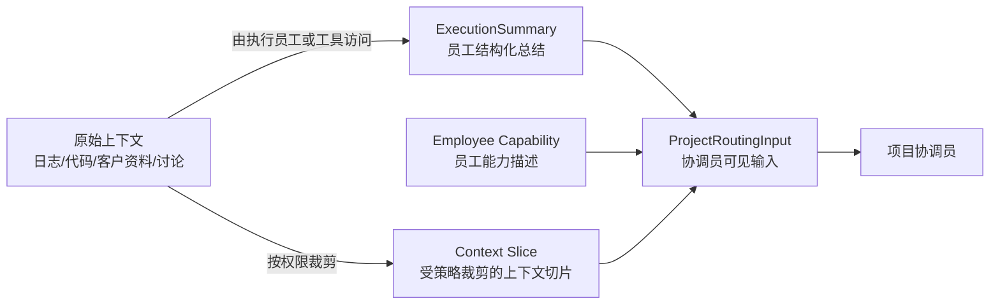

# 项目协调员控制平面设计总结

日期：2026-06-05 16:06（Asia/Shanghai）

## 1. 设计结论

SuperTeam 的项目协作主线应采用“一个项目一个项目协调员”的模型。项目协调员是数字员工，不是人类员工；它负责项目内任务分派、流转、状态跟踪、阶段性汇总和汇报材料生成。项目协调员不承担最终业务责任，不直接审批高风险动作，不直接执行专业任务。

每个项目协调员必须绑定一个固定人类归属人。人类归属人负责审批、驳回、要求补充证据、接收汇报和承担最终业务判断。项目协调员的自动化能力必须受项目预算、权限范围、结构化证据、置信度门槛和人类审核机制约束。

稳定边界：

- 团队是长期能力池和治理边界。
- 项目是临时交付闭环和信息聚合中心。
- 项目协调员是项目内调度型数字员工。
- 人类归属人是项目协调员的监督、审批和汇报接收对象。
- 执行员工是开发、测试、运维、需求等专业数字员工或人类员工。
- Runtime Agent 只负责客户侧执行，不承担项目协作策略和长期业务状态。

## 2. 与 Paperclip 的关系

本设计借鉴 Paperclip 的任务、预算、执行记录和工作产物思想，但不照搬 Paperclip 的“AI 公司 / CEO / Org Chart”叙事。SuperTeam 更适合定位为企业项目交付中的人机协作控制平面。

相对 Paperclip 的优势：

- 项目是协作主轴，更贴近企业真实需求、开发、测试、上线、运维链路。
- 人类员工和数字员工都是一等参与者，适合企业审批和责任归属。
- Runtime Agent 部署在客户侧执行环境，更容易纳入客户数据、测试环境、仿真环境和审计要求。
- 汇报、证据、审批和驳回围绕项目沉淀，便于验收和追责。

相对 Paperclip 的劣势：

- 项目、团队、员工、Runtime、能力、审批同时存在，模型复杂度更高。
- 项目协调员是单点状态机，必须依靠反馈闭环和结构化证据控制错误积累。
- 企业环境里的验证接口、测试环境和数据访问边界更难统一。
- 产品叙事不如“AI 公司”直观，需要用项目交付闭环表达价值。

## 3. 架构流程图

> 下图由 gpt-image2 路线生成，用于快速理解职责边界；精确结构以本节 Mermaid 源图为准。

## 4. 项目内数据流转图

> 下图由 gpt-image2 路线生成，用于快速理解项目内事件、任务、证据和人类决策的闭环；精确结构以本节 Mermaid 源图为准。

## 5. 协调员状态图

## 6. 核心对象建议

### 6.1 Project

项目是信息聚合和交付验收单元。

建议字段：

- `id`
- `tenant_id`
- `name`
- `description`
- `status`
- `coordinator_employee_id`
- `human_owner_user_id`
- `leader_user_id`
- `budget_policy`
- `routing_policy`
- `reporting_policy`
- `created_at`
- `updated_at`

### 6.2 ProjectMember

项目成员是临时参与关系，可以指向人类员工、数字员工或团队。

建议字段：

- `project_id`
- `principal_type`: `human_user` / `digital_employee` / `team`
- `principal_id`
- `project_role`: `coordinator` / `executor` / `reviewer` / `observer`
- `status`

### 6.3 ProjectTask

项目任务是项目内可分派、可执行、可验证的工作项。

建议字段：

- `project_id`
- `title`
- `summary`
- `assigned_team_id`
- `assigned_employee_id`
- `requested_by_coordinator_id`
- `status`
- `risk_level`
- `confidence_threshold`
- `budget_limit`
- `created_from_event_id`

### 6.4 RouteDecision

协调员每次分派必须产生结构化决策，避免事后无法解释。

建议字段：

- `project_id`
- `work_item_id`
- `coordinator_employee_id`
- `candidate_employees`
- `selected_employee_id`
- `selected_team_id`
- `reason`
- `confidence`
- `evidence_refs`
- `budget_estimate`
- `requires_human_review`

### 6.5 RouteOutcome

任务完成、转派或扩散后必须回写结果，用于后续改进协调员的路由策略。

建议字段：

- `route_decision_id`
- `outcome_status`: `accepted` / `misrouted` / `needs_more_info` / `completed` / `escalated`
- `actual_owner_employee_id`
- `actual_owner_team_id`
- `result_confidence`
- `cost_actual`
- `latency_ms`
- `lessons`

### 6.6 ExecutionSummary

执行员工不能只交自然语言总结，必须交结构化结论和证据。

建议字段：

- `conclusion`
- `evidence_refs`
- `confidence`
- `uncertainty`
- `suspected_owner_team`
- `recommended_next_action`
- `missing_information`
- `requires_human_review`
- `artifact_refs`

### 6.7 BudgetLedger

预算第一版建议统一归属项目预算，同时记录实际消耗者。

建议字段：

- `project_id`
- `work_item_id`
- `coordinator_employee_id`
- `executing_employee_id`
- `cost_type`: `route` / `probe` / `execute` / `review`
- `charged_to`: `project_budget`
- `amount`
- `reason`

## 7. 协调员的上下文边界

协调员不应读取完整项目原始上下文，只读取可路由上下文。可路由上下文由 Control Plane 按策略裁剪生成。

最小输入：

- 当前任务摘要。
- 上一个执行员工返回的结构化总结。
- 当前项目任务状态。
- 候选数字员工能力描述。
- 固定汇报对象。
- 风险等级。
- 预算剩余额度。
- 是否需要人类审核。

禁止默认暴露：

- 全量客户资料。
- 全量代码仓库。
- 全量原始日志。
- 团队外敏感上下文。
- 与当前路由无关的历史讨论。

## 8. 分派策略

第一版采用“单点优先 + 置信度扩散”策略。

流程：

1. 协调员根据任务摘要、员工能力描述、历史 RouteOutcome 选择一个最高置信候选员工。
2. 候选员工执行诊断或任务。
3. 候选员工返回 ExecutionSummary、EvidenceRefs 和 Confidence。
4. 如果置信度高于门槛且不需要人类审核，协调员继续流转或汇总。
5. 如果置信度低于门槛，协调员申请扩散诊断额度，再派发给其他候选员工。
6. 如果多方结论冲突且置信度接近，协调员不得强行裁决，必须发起 DecisionRequest 或补充探测。

## 9. 汇报与审核

协调员生成的汇报必须是可审计报告，不是漂亮的二手总结。

汇报必须包含：

- 项目目标和当前阶段。
- 已完成任务。
- 未完成任务和阻塞。
- 关键 ExecutionSummary。
- EvidenceRefs 和 ArtifactRefs。
- 风险与不确定性。
- 预算消耗。
- 需要人类决策的 DecisionRequest。

人类归属人可以：

- 批准报告。
- 驳回报告。
- 要求补充证据。
- 要求重新分派。
- 要求升级给 leader。

## 10. 可靠性约束

协调员的自进化只能基于结构化结果，不允许只基于自己的对话总结。

必须保留：

- RouteDecision。
- RouteOutcome。
- ExecutionSummary。
- EvidenceRefs。
- BudgetLedger。
- DecisionRequest。
- HumanDecision。

验证能力优先级：

1. 可直接运行的测试环境。
2. 可调用的数据接口。
3. 可复现的仿真环境。
4. 可审计的日志和工件引用。
5. 人类审核和驳回。

如果没有任何验证能力，协调员必须降低结果置信度，并在汇报中明确标记不可验证。

## 11. MVP 范围

建议第一阶段只做以下能力：

- 一个项目绑定一个项目协调员数字员工。
- 一个项目协调员绑定一个人类归属人和一个 leader。
- 项目事件流、项目任务、RouteDecision、ExecutionSummary、DecisionRequest 的最小闭环。
- 单点优先派发，置信度不足时允许扩散诊断。
- 项目级预算 ledger。
- 最终汇报带证据链，并支持人类驳回。

第一阶段暂不做：

- 多协调员或阶段协调员。
- 自动学习复杂模型。
- 完整资源排班系统。
- 复杂跨项目负载调度。
- 让协调员读取完整原始上下文。

## 12. 结论

该设计具备可行性，但不能被定义成“一个聪明协调员自动管理项目”。更准确的定义是：

> 一个受预算、权限、证据、反馈和人类审核约束的项目协调数字员工。

只要保持协调员不执行专业任务、不直接审批、不读取完整上下文，并把所有分派、结果、成本和人类决定结构化落库，这个模型可以作为 SuperTeam 区分 Paperclip 的核心产品主线。
