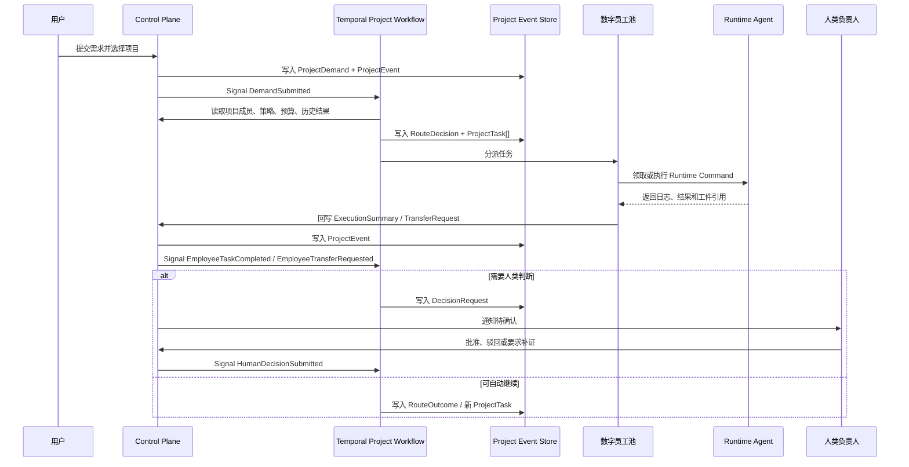

# 项目管理入口与 Temporal 虚拟协调线程方案

日期：2026-06-10 16:00（Asia/Shanghai）  
状态：讨论结论沉淀，待进入详细设计与实施计划

## 1. 背景

本方案沉淀本轮关于项目管理入口、项目内数字员工选择、用户需求提交、项目协调并发和 Temporal 编排边界的讨论结论。

SuperTeam 的项目不只是软件交付项目，也可以表示一次具体问题场景的闭环。用户需要先选择或创建一个项目，再从项目内已接入的数字员工池中发起需求。系统随后基于项目策略和项目内可用数字员工生成编排计划，并由 Runtime Agent 与 Provider 执行具体任务。

本轮讨论对旧口径做出一个关键修正：

- 不在项目管理里把“项目协调员”建模为可复用数字员工。
- 项目显式定义人类负责人、验收人、项目数字员工池和协调策略。
- 项目内的协调员是虚拟业务身份，由 Temporal Workflow 承载，是项目自带的独占协调状态机。

## 2. 核心结论

一个项目应绑定一个长期存在的 Temporal 协调 Workflow：

```text
WorkflowID = project-coordinator:{project_id}
```

该 Workflow 是项目的虚拟协调线程。它不是操作系统线程，也不是一个可复用数字员工，而是项目级状态机和事件处理器。

项目协调逻辑的职责是：

- 接收用户提交的需求。
- 读取项目内已选择的数字员工池。
- 根据调用llm与策略规划结合规划任务。
- 生成可审计的 `ProjectTask`、`RouteDecision`。
- 等待数字员工执行结果、转派请求、补证请求或人类决策。
- 汇总阶段性结果，生成可审计报告草稿。

项目协调逻辑不承担的职责：

- 不作为数字员工出现在数字员工列表里。
- 不承接人类负责人、审批人、验收人的责任。
- 不绕过人类负责人批准高风险动作。
- 不直接执行专业任务。
- 不默认读取完整原始上下文。

## 3. 菜单与入口口径

项目管理仍然是项目管理入口，负责项目列表、项目创建、项目配置、项目成员、项目运行状态、项目事件、证据、审批和归档等管理能力。它不应被“提出需求、选择项目、使用项目内团队完成需求”的需求提交入口替代。

本轮讨论中的参考图代表未来另一个一级入口或全局快捷入口，可暂命名为“任务发起”。该入口用于让用户输入需求、选择项目，并触发项目内 Temporal 协调 Workflow 规划任务。

因此菜单建议拆成两个不同心智模型：

- 项目管理：管理项目本身，查看和配置项目运行闭环。
- 任务入口：从用户问题出发，选择一个项目并提交需求，由该项目内已选择的数字员工池完成后续执行。

需求入口的核心结构：

```text
提出需求，组建团队，完成需求

用户输入需求：
- 粘贴自然语言需求
- 上传附件(可选)
- 选择项目
- 点击生成编排

项目上下文：
- 当前项目
- 人类负责人
- 已接入数字员工
- 可添加数字员工
- 协调策略
- 预计任务数、并发数、审批要求
```

项目管理中的项目创建流程应聚焦：

1. 填写项目名称、目标和场景描述。
2. 选择人类负责人，可选 leader 或验收人。
3. 从数字员工列表中选择本项目可调度的数字员工。
4. 设置协调策略，例如先生成结构让人确认、允许自动派发低风险任务、严格审批高风险动作。
5. 创建项目并启动或注册项目级 Temporal 协调 Workflow。

创建完成后，用户可以从项目详情页发起需求，也可以从独立需求入口选择该项目并提交需求。两者进入同一套项目协调 Workflow。

## 4. 项目与协调线程的边界

### 4.1 Project

`Project` 是业务闭环容器，也是 Temporal 协调 Workflow 的业务归属对象。

建议字段：

- `id`
- `tenant_id`
- `team_id`
- `name`
- `description`
- `status`
- `human_owner_user_id`
- `leader_user_id`
- `acceptance_user_id`
- `coordination_workflow_id`
- `coordination_status`
- `coordination_policy`
- `budget_policy`
- `risk_policy`
- `created_at`
- `updated_at`

不建议再使用：

- `coordinator_employee_id`

原因是协调逻辑不是数字员工实体，而是项目内置的虚拟协调状态机。

### 4.2 ProjectMember

`ProjectMember` 表示项目内临时参与关系，可指向人类、数字员工或团队。

建议字段：

- `project_id`
- `principal_type`: `human_user` / `digital_employee` / `team`
- `principal_id`
- `project_role`: `owner` / `leader` / `acceptance` / `executor` / `reviewer` / `observer`
- `status`
- `created_at`

不建议使用：

- `project_role = coordinator`

项目协调线程不是项目成员。它属于项目运行机制。

### 4.3 ProjectEmployeePool

项目内可调度数字员工池可以通过 `ProjectMember` 中的 `principal_type = digital_employee` 和 `project_role = executor` 表达，也可以在后续抽象为独立视图或物化表。

第一版建议复用 `ProjectMember`，避免多建一张重复事实表。

需要记录的语义：

- 哪些数字员工可被本项目调度。
- 每个数字员工在本项目内的可用角色。
- 是否需要人类确认后才能调度。
- 并发上限、预算上限和风险边界。

## 5. Temporal 编排模型

### 5.1 一个项目一个协调 Workflow

每个项目拥有一个项目级协调 Workflow：

```text
project-coordinator:{project_id}
```

该 Workflow 持有项目协调状态，包括：

- 当前项目阶段。
- 待处理需求。
- 已生成计划。
- 已分派任务。
- 等待中的员工结果。
- 待处理转派请求。
- 待人类决策事项。
- 预算消耗快照。
- 项目事件游标。

### 5.2 信号输入

项目级 Workflow 通过 Temporal Signal 接收外部事件。

建议 Signal：

- `DemandSubmitted`
- `EmployeeTaskCompleted`
- `EmployeeTaskFailed`
- `EmployeeTransferRequested`
- `EvidenceSubmitted`
- `HumanDecisionSubmitted`
- `BudgetUpdated`
- `ProjectPolicyChanged`
- `ProjectMemberChanged`

Control Plane 接到 API 请求或 Runtime 回写后，应先把事实写入数据库和事件流，再向 Temporal Workflow 发送 signal。

### 5.3 Activity 与 Child Workflow

项目协调 Workflow 不直接执行长耗时专业任务。它负责创建任务和等待结果。

建议边界：

- 使用 Activity 读取项目、成员、策略和历史结果。
- 使用 Activity 创建 `ProjectTask`、`RouteDecision`、`DecisionRequest`、`BudgetLedger`。
- 使用 Child Workflow 或外部任务记录承载数字员工执行。
- 数字员工执行仍由 Control Plane -> Runtime Agent -> Provider 路径完成。

第一版不强制每个数字员工任务都是 Temporal Child Workflow。可以先让 Workflow 写入任务事实，再等待 Runtime 回写 signal。后续如果需要更强的 Temporal 可视化和重试语义，再把任务执行升级为 Child Workflow。

## 6. 并发模型

本方案的并发模型是：

```text
一个项目 = 一个协调 Workflow 状态机
多个数字员工任务 = 并发执行
协调决策 = 串行提交
```

### 6.1 为什么一个协调线程足够

协调员是项目级规划与收敛逻辑，不是执行任务的 worker。

它的工作方式是事件驱动：

1. 用户提交需求，Workflow 被唤醒。
2. Workflow 规划任务，写入任务和路由决策。
3. 数字员工并发执行任务。
4. Workflow 进入等待状态。
5. 某个数字员工返回结果、失败、请求转派或提交证据，Workflow 被 signal 唤醒。
6. Workflow 处理该事件，必要时生成新任务、发起人类决策或更新汇报。
7. 处理完成后继续等待下一个事件。

Temporal Workflow 在等待 signal、timer 或外部结果时不占用真实执行线程。所谓“一个项目一个独占线程逻辑”，应理解为项目级单写入状态机，而不是长期占用一个 OS thread。

### 6.2 哪些部分可以并发

可以并发：

- 多个数字员工执行不同任务。
- 一个数字员工在自身执行槽位允许时处理多个独立任务。
- 多个 Runtime Agent 在不同节点执行任务。
- 多个项目各自拥有独立协调 Workflow，并行运行。

### 6.3 哪些部分应该串行

同一项目内的协调决策应该串行提交。

串行的原因：

- 避免重复规划。
- 避免两个规划同时修改项目阶段。
- 避免预算重复扣减。
- 避免两个转派请求互相覆盖。
- 避免人类决策和自动规划同时对同一任务生效。

项目级 Workflow 是项目事实更新的协调者。所有协调结果都应通过事件序号、项目状态版本或 Workflow 内部状态保证有序提交。

## 7. 需求提交后的数据流



## 8. 核心对象建议

### 8.1 ProjectDemand

用户从入口提交的一次需求。

建议字段：

- `id`
- `project_id`
- `tenant_id`
- `submitted_by_user_id`
- `title`
- `content`
- `source_type`: `manual` / `github` / `ticket` / `document` / `log`
- `source_refs`
- `attachments`
- `priority`
- `risk_level`
- `status`
- `created_event_id`
- `created_at`

### 8.2 CoordinationJob

协调 Workflow 每次被唤醒后处理的一次协调工作。

建议字段：

- `id`
- `project_id`
- `workflow_id`
- `trigger_event_id`
- `job_type`: `plan` / `route` / `review_result` / `transfer` / `summarize` / `human_decision`
- `status`
- `input_snapshot_ref`
- `output_event_ids`
- `started_at`
- `finished_at`

`CoordinationJob` 用于审计和观察协调线程的每次处理，不代表一个数字员工任务。

### 8.3 ProjectTask

项目内可分派、可执行、可验证的工作项。

建议字段：

- `id`
- `project_id`
- `demand_id`
- `route_decision_id`
- `assigned_digital_employee_id`
- `title`
- `summary`
- `input_context_refs`
- `status`
- `risk_level`
- `requires_human_approval`
- `budget_limit`
- `created_from_event_id`
- `created_at`
- `updated_at`

### 8.4 RouteDecision

虚拟协调线程每次分派都必须留下结构化决策。

建议字段：

- `id`
- `project_id`
- `coordination_job_id`
- `candidate_digital_employee_ids`
- `selected_digital_employee_ids`
- `reason`
- `input_requirements`
- `expected_outputs`
- `budget_estimate`
- `requires_human_review`
- `created_event_id`
- `created_at`

不要使用：

- `coordinator_employee_id`

如需记录执行者，使用：

- `actor_type = project_coordinator`
- `actor_id = project_id` 或 `workflow_id`

### 8.5 ExecutionSummary

数字员工返回的结构化结果。

建议字段：

- `id`
- `project_id`
- `project_task_id`
- `digital_employee_id`
- `conclusion`
- `evidence_refs`
- `artifact_refs`
- `confidence_factors`
- `uncertainty`
- `missing_information`
- `recommended_next_action`
- `requires_human_review`
- `transfer_request_id`
- `created_event_id`
- `created_at`

置信度不应只保存一个不可解释的小数。第一版建议保存可解释因子，例如测试通过率、证据完整度、历史命中、人工复核状态。

### 8.6 TransferRequest

数字员工认为需要转派、补充诊断或交给其他员工时提交的请求。

建议字段：

- `id`
- `project_id`
- `project_task_id`
- `requested_by_digital_employee_id`
- `reason`
- `suggested_employee_type`
- `suggested_digital_employee_ids`
- `missing_context_refs`
- `status`: `pending` / `accepted` / `rejected` / `converted_to_task`
- `created_event_id`
- `created_at`

TransferRequest 由项目协调 Workflow 决定是否接受，不允许数字员工之间直接自由聊天或私下转派。

### 8.7 DecisionRequest

需要人类负责人、leader 或验收人判断的暂停点。

建议字段：

- `id`
- `project_id`
- `target_user_id`
- `decision_type`: `approve_plan` / `approve_risk_action` / `request_evidence` / `accept_report` / `reject_report`
- `title`
- `summary`
- `risk_level`
- `options`
- `status`
- `created_event_id`
- `resolved_event_id`
- `created_at`
- `resolved_at`

### 8.8 BudgetLedger

项目级预算流水，记录实际消耗者和触发者。

建议字段：

- `id`
- `project_id`
- `coordination_job_id`
- `project_task_id`
- `digital_employee_id`
- `cost_type`: `plan` / `route` / `execute` / `review` / `summarize`
- `estimated_tokens`
- `actual_tokens`
- `source`
- `reason`
- `created_event_id`
- `created_at`

## 9. 审计与 actor 口径

项目协调线程是虚拟 actor。

审计建议：

```text
actor_type = project_coordinator
actor_id = project_id 或 temporal_workflow_id
```

数字员工执行任务时：

```text
actor_type = digital_employee
actor_id = digital_employee_id
```

人类负责人审批时：

```text
actor_type = human_user
actor_id = user_id
```

这样可以避免把项目协调线程误建模成数字员工，也能保持审计链完整。

## 10. 与旧项目协调员设计的关系

旧设计中“一个项目绑定一个项目协调员数字员工”的口径需要调整。

保留的原则：

- 项目是交付闭环和信息聚合中心。
- 人类负责人承担最终业务判断。
- 高风险动作必须进入人类决策。
- 数字员工不直接自由聊天，通过结构化对象协作。
- 每个阶段都必须产出可持久化的工件、证据、决策或交接包。
- 协调逻辑不默认读取完整原始上下文。

调整的内容：

- “项目协调员数字员工”改为“项目内置虚拟协调线程”。
- `coordinator_employee_id` 改为 `coordination_workflow_id`。
- `project_role = coordinator` 不进入 ProjectMember。
- 项目创建时不创建协调员数字员工，而是启动或注册项目级 Temporal Workflow。
- 项目内可调度对象只来自项目已选择的数字员工池。

## 11. 第一版 MVP 范围

第一版建议只做以下能力：

- 项目创建入口：名称、目标、人类负责人、验收人、项目数字员工池、协调策略。
- 需求提交入口：用户输入需求、选择项目、上传附件、设置优先级和风险。
- 项目级 Temporal Workflow：接收需求、生成计划、写入任务、等待回写和人类决策。
- 项目任务分派：只在项目数字员工池内选择执行员工。
- 数字员工并发执行：复用现有 Runtime Agent 和 Provider 执行链路。
- 结构化回写：ExecutionSummary、EvidenceRefs、ArtifactRefs、TransferRequest。
- 人类决策：批准、驳回、要求补证。
- 审计和事件流：所有关键动作写入 ProjectEvent。

第一版暂不做：

- 多协调员或阶段协调员。
- 自动学习复杂路由策略。
- 跨项目资源排班。
- 数字员工之间自由对话。
- 协调线程默认读取完整仓库、日志或客户资料。
- 复杂可视化流程编辑器。
- 精准成本核算和复杂预算预测。

## 12. 技术落地建议

### 12.1 Control Plane

Control Plane 是项目事实源。

负责：

- 项目、项目成员、需求、任务、事件、决策、证据和预算的持久化。
- 统一权限校验。
- 向 Temporal Workflow 发送 signal。
- 接收 Runtime 和数字员工执行回写。
- 提供 Web API。

### 12.2 Temporal

Temporal 负责项目协调状态机。

负责：

- 项目级协调 Workflow 生命周期。
- 事件驱动唤醒。
- 串行处理项目级协调决策。
- 等待数字员工回写、人类决策和超时。
- 调用 Control Plane Activity 写入结构化结果。

### 12.3 Runtime Agent

Runtime Agent 仍只负责节点执行。

负责：

- 领取任务。
- 管理 Provider 进程和会话。
- 回传日志、事件、结果和工件引用。

Runtime Agent 不负责项目策略、人类审批策略和长期项目状态。

### 12.4 Web Console

Web Console 至少需要两个入口，但它们不应互相替代：

- 项目管理入口：项目列表、创建项目、项目详情、成员与数字员工池配置、协调策略、运行状态、事件流、证据、审批和归档。
- 需求提交入口：选择项目、输入需求、查看该项目员工池、提交需求并触发项目协调 Workflow。

项目管理入口的默认视图应是项目管理工作台或项目列表，而不是需求提交页。需求提交入口可以作为全局一级菜单、顶部快捷操作，或项目详情中的“发起需求”操作。

## 13. 风险与约束

- 协调 Workflow 内不要执行非确定性逻辑。LLM 调用、数据库读取、HTTP 调用必须放在 Activity 中。
- LLM 规划结果必须结构化落库，并经过服务端校验。
- 项目数字员工池变更要进入事件流，Workflow 需要感知策略变化。
- 同一项目的协调决策必须串行提交，避免重复分派和预算冲突。
- 数字员工请求转派时，只能提交 TransferRequest，由协调 Workflow 决定是否转派。
- 置信度展示必须可解释，不使用没有来源的小数装饰。
- 高风险动作必须生成 DecisionRequest，等待人类负责人确认。

## 14. 结论

项目管理的核心不应是“给每个项目创建一个协调员数字员工”，而应是“每个项目拥有一个由 Temporal 承载的虚拟协调线程”。

这个模型更符合 SuperTeam 的控制平面定位：

- 项目是业务事实入口。
- 人类负责人是最终责任人。
- 数字员工是项目内可调度执行资源。
- Temporal Workflow 是项目级协调状态机。
- Control Plane 是事实、权限、审计和 API 边界。
- Runtime Agent 是执行节点，不承担项目策略。

因此，第一版应同时明确两个产品面：

- 项目管理面：创建和管理项目、人类负责人、数字员工池、协调策略、运行状态与审计闭环。
- 需求发起面：提出需求、选择项目、使用项目员工池生成编排、并发执行、结构化回写、人类决策与汇报归档。

两者共享同一个项目级 Temporal 协调 Workflow，但菜单入口和用户心智应保持区分。
