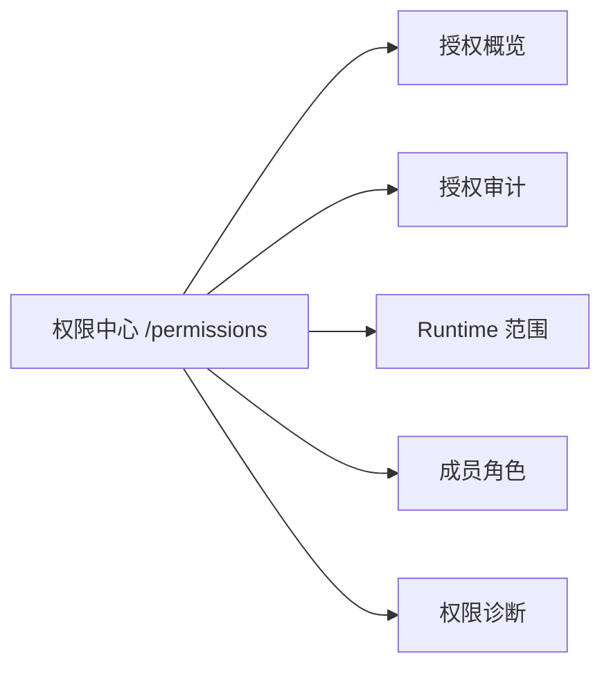

# SuperTeam 权限中心 Web 功能 Spec

> 日期：2026-06-01  
> 状态：待评审  
> 决策：采用“混合 MVP”：授权审计完整可用，Runtime 范围可配置，成员角色首版只读。  
> 参考项目：`/Users/wangpei/src/github/agentic/paperclip`

## 1. 背景

SuperTeam 已经完成第一阶段渐进式授权边界：

- Control Plane 提供 `internal/authz.Authorizer` 统一授权接口。
- `/api/auth/me` 已接入 `console.access` 判断。
- Runtime claim 已接入 `task.claim` 判断。
- 授权决策已写入 `web_operation_logs`，记录允许、拒绝、引擎、规则、Actor、资源和租户上下文。

现在需要在 Web 控制台中增加一级菜单 **权限中心**，把这些后端能力转化为企业管理员能理解和操作的功能面。

本功能不是一次性建设完整 IAM，也不是 OpenFGA 模型编辑器。首版目标是让企业内落地时最关键的三类问题可见、可查、可改：

- 谁被允许或拒绝了什么操作。
- 哪些 Runtime 节点可以服务哪些租户或团队。
- 用户、租户成员和角色当前是什么状态。

## 2. Paperclip 参考结论

Paperclip 的权限实现值得借鉴，但不能直接照搬产品语义。

### 2.1 值得借鉴

Paperclip 的权限模型有几个对 SuperTeam 很有价值的模式：

- 人和 Agent 使用同一套 membership + grant 模型，而不是两套权限系统。
- 授权对象用 `principal_type`、`principal_id` 表达，可以覆盖 user、agent 等不同主体。
- 显式 grant 独立成表，例如 `principal_permission_grants`，并带 `permission_key`、`scope`、`granted_by`。
- 授权判断返回可解释的 decision，包含 allowed、reason、explanation、matched grant。
- Company Access 页面把成员、加入审批、安全移除和权限入口放在同一个访问控制语境下。
- 活动日志和授权解释是权限产品的一部分，不是排障时临时查数据库。

这些思路可以转译成 SuperTeam 的企业内控语言：用户、数字员工、Runtime 节点、外部能力、审批和审计共享一套授权解释框架。

### 2.2 不能照搬

SuperTeam 的产品目标不是 Paperclip 的 company metaphor 或 zero-human company 叙事。SuperTeam 面向国内 ToB 企业内落地，核心对象是：

- 租户和团队。
- 数字员工和流程。
- 客户侧 Runtime Agent。
- Provider 执行器。
- 外部能力和连接器。
- 人类审批、审计、合规和上线控制。

因此，权限中心不应命名或组织为 Company Settings / Access，也不应直接暴露 Paperclip 的 board、issue、agent hierarchy 语义。SuperTeam 应使用 **权限中心** 作为一级菜单，未来可以再并入更大的“组织治理”或“安全治理”模块。

## 3. 产品定位

权限中心是 SuperTeam 的企业访问控制与授权审计工作台。

首版面向四类用户：

- 平台管理员：确认登录后的控制台访问是否正常，处理用户权限问题。
- 租户管理员：查看成员角色，理解某个用户为什么能或不能访问。
- Runtime 运维人员：配置 Runtime 节点服务范围，避免客户侧执行机领取越权任务。
- 安全和审计人员：查看授权拒绝、关键授权变更和 Runtime claim 记录。

页面文案使用业务语言，不使用 OpenFGA tuple、relation、model schema 作为主要概念。

## 4. 方案选择

### 4.1 方案 A：Paperclip 式成员访问页

把功能集中在“成员与授权”页面，优先做成员、角色、邀请和 grant。

优点是用户理解成本低，和传统后台用户管理接近。缺点是 SuperTeam 当前最先落地的授权价值在 Runtime 范围和授权审计，单纯成员页会弱化执行节点治理。

### 4.2 方案 B：合规审计优先页

把权限中心做成审计控制台，优先展示授权决策、拒绝原因、风险事件和查询导出。

优点是符合企业合规场景。缺点是缺少可操作配置，管理员发现 Runtime 越权或缺 scope 后还要离开页面处理。

### 4.3 方案 C：混合 MVP

采用顶层 **权限中心**，内部按 Tab 划分：

- 授权概览。
- 授权审计。
- Runtime 范围。
- 成员角色。
- 权限诊断。

首版保持边界：

- 授权审计完整可用。
- Runtime scope 支持配置。
- 成员角色只读展示。
- 权限诊断支持基于 `Authorizer.Check` 的 dry-run 检查。
- 不提供完整角色编辑、OpenFGA 模型编辑和高级 grant 编辑。

决策：采用方案 C。

## 5. 信息架构

新增 Web 一级菜单：

- 菜单名：`权限中心`
- 建议路径：`/permissions`
- 建议图标：`ShieldCheck` 或 `KeyRound`
- 前端目录：`apps/web/src/features/permissions`
- 后端接口分组：`/api/authz`

页面采用 Tabs，不做营销式首页。进入页面默认展示“授权概览”。



## 6. Tab 设计

### 6.1 授权概览

目标：让管理员一眼看到权限系统是否健康。

内容：

- 授权引擎状态：当前为 `db`，未来展示 OpenFGA store、model version、同步状态。
- 最近 24 小时授权判断数、拒绝数、拒绝率。
- 最近拒绝最多的动作，例如 `console.access`、`task.claim`。
- Runtime claim 拒绝趋势。
- 最近 10 条高价值授权事件。

首版数据来源：

- `web_operation_logs` 中 `module = 'authz'` 的记录。
- `details.engine`、`details.reason`、`details.matched_rule`、`details.actor`、`details.resource`。

交互：

- 点击统计卡片进入授权审计并带上筛选条件。
- 点击 Runtime 相关异常进入 Runtime 范围 Tab。

### 6.2 授权审计

目标：让授权决策可查询、可解释、可追踪。

表格字段：

- 时间。
- 结果：允许、拒绝。
- 动作：例如 `console.access`、`task.claim`。
- Actor：用户、Runtime 节点、数字员工或服务账号。
- 资源：console、task、tenant、team、runtime_node。
- 租户、团队。
- 引擎：`db`、未来 `openfga`。
- 原因和命中规则。
- 请求 ID。

筛选条件：

- 时间范围。
- 结果。
- 动作。
- Actor 类型和 ID。
- 资源类型和 ID。
- 租户和团队。
- 引擎。
- 请求 ID。

详情抽屉：

- 展示 `CheckRequest` 的业务化摘要。
- 展示 `Decision`：allowed、reason、matched_rule、requires_audit。
- 展示快照 JSON，但默认折叠。
- 给出下一步建议，例如“为 Runtime 增加团队范围”或“确认用户是否为租户成员”。

首版不做导出。后续可增加 CSV 导出和审计报表。

### 6.3 Runtime 范围

目标：让管理员可以配置客户侧 Runtime Agent 能服务的租户和团队范围。

列表字段：

- Runtime 节点名称和 `node_id`。
- 状态、最近心跳、当前负载、最大槽位。
- 支持 Provider。
- 已授权范围：租户级、团队级。
- 最近一次 `task.claim` 拒绝原因。

可配置操作：

- 为 Runtime 节点新增租户范围。
- 为 Runtime 节点新增团队范围。
- 禁用或重新启用已有范围。

约束：

- 不在 Web 里直接修改 Runtime token。
- 不在首版做复杂条件 scope，例如 provider 级、风险级、仓库路径级。
- 所有 scope 变更写入 `web_operation_logs`，`module = 'authz'`。
- Runtime 范围变更只影响后续 claim，不主动中断已有 lease；中断策略后续由 Runtime 和任务治理模块设计。

推荐交互：

- 节点列表左侧，详情或编辑抽屉右侧。
- 范围以租户和团队徽标展示。
- 禁用范围需要确认弹窗，文案明确说明“后续任务领取会受影响”。

### 6.4 成员角色

目标：提供用户和租户成员关系的只读视图，为后续角色管理做铺垫。

列表字段：

- 用户名、邮箱、账号状态。
- 租户角色：owner、admin、member、viewer。
- 团队角色。
- 是否满足 `console.access`。
- 最近一次授权拒绝。

首版只读：

- 不编辑用户状态。
- 不编辑成员角色。
- 不创建邀请。
- 不配置高级 grant。

原因：

- 当前项目已有独立“用户管理”入口，权限中心不应在首版复制账号管理。
- 角色编辑会影响数据模型和审批要求，应该在后续独立设计。

从 Paperclip 借鉴的后续方向：

- 人和数字员工共享 principal 权限模型。
- 角色编辑时同时展示对应 grant。
- 移除成员前检查未完成任务、审批和工件归属，提供转交方案。

### 6.5 权限诊断

目标：给管理员一个“为什么能或不能”的解释工具。

表单字段：

- Actor 类型：user、runtime_node、employee、service_account。
- Actor ID。
- Action：首版支持 `console.access`、`tenant.access`、`team.access`、`task.claim`。
- Resource 类型和 ID。
- 租户、团队。

结果展示：

- 允许或拒绝。
- reason。
- matched_rule。
- engine。
- snapshot 摘要。
- 建议动作。

接口行为：

- 使用 `Authorizer.Check` 的 dry-run 模式。
- dry-run 诊断默认写一条低风险审计记录，便于追踪管理员查看过哪些权限判断。
- 如果缺少必要上下文，返回可读错误，不隐式放行。

## 7. 后端 API 设计

新增或扩展 `contracts/control-plane/authz.yaml`，并纳入 OpenAPI 聚合。

建议接口：

- `GET /api/authz/overview`
  - 返回授权统计、拒绝趋势、引擎状态和最近事件。
- `GET /api/authz/decisions`
  - 查询授权审计记录。
- `GET /api/authz/runtime-scopes`
  - 返回 Runtime 节点和 scope 列表。
- `POST /api/authz/runtime-scopes`
  - 新增 Runtime scope。
- `PATCH /api/authz/runtime-scopes/{scope_id}`
  - 启用或禁用 scope。
- `GET /api/authz/members`
  - 返回用户、租户成员、团队成员和 console access 摘要。
- `POST /api/authz/check`
  - 权限诊断 dry-run。

接口统一要求：

- 所有接口需要已登录用户。
- 所有写操作必须通过 `Authorizer.Check`，例如新增动作 `runtime_scope.manage`。
- 所有写操作必须写 `web_operation_logs`。
- 查询接口首版可以只要求 `console.access`，后续细化为新增动作 `authz.audit.read`、`runtime_scope.read` 等。

## 8. 数据模型与日志

首版优先复用现有表：

- `auth_users`
- `tenant_members`
- `runtime_nodes`
- `runtime_node_scopes`
- `tasks`
- `web_operation_logs`

首版不新增 OpenFGA 业务表，不新增完整 grant 表。

`web_operation_logs.details` 中授权相关记录建议规范化为：

```json
{
  "engine": "db",
  "engine_version": "db-authorizer-v1",
  "actor": {
    "type": "runtime_node",
    "id": "node-1"
  },
  "resource": {
    "type": "task",
    "id": "..."
  },
  "tenant_id": "...",
  "team_id": "...",
  "allowed": false,
  "reason": "runtime scope does not cover task",
  "matched_rule": "",
  "audit_reason": "runtime task claim"
}
```

后续当审计查询压力、合规字段或 OpenFGA 版本追踪变复杂时，再拆出专门的 `authz_decisions` 表。

## 9. 前端实现边界

前端遵循现有 shadcn-admin 风格：

- 使用 `Header`、`Main`、`Tabs`、`Table`、`Badge`、`Dialog`、`Sheet`、`Select`、`Input`。
- 使用 TanStack Query 拉取真实 API。
- 使用 TanStack Table 承载审计表格。
- 使用 lucide-react 图标。
- 页面保持工作台风格，信息密度高、筛选清晰，不做宣传型 hero。

建议文件：

- `apps/web/src/routes/_authenticated/permissions/index.tsx`
- `apps/web/src/features/permissions/index.tsx`
- `apps/web/src/features/permissions/components/authorization-overview.tsx`
- `apps/web/src/features/permissions/components/authorization-audit-table.tsx`
- `apps/web/src/features/permissions/components/runtime-scopes.tsx`
- `apps/web/src/features/permissions/components/member-roles.tsx`
- `apps/web/src/features/permissions/components/permission-diagnostics.tsx`
- `apps/web/src/lib/api/authz.ts`

## 10. 核心流程

### 10.1 查询一次授权拒绝

1. 管理员进入权限中心。
2. 打开“授权审计”。
3. 筛选 `result = failed`、`action = task.claim`。
4. 打开详情抽屉。
5. 页面展示 Runtime 节点、任务、租户、团队、拒绝原因和命中规则。
6. 如果原因是 Runtime scope 缺失，页面提供跳转到 Runtime 范围的入口。

### 10.2 配置 Runtime 服务团队

1. 管理员进入“Runtime 范围”。
2. 选择一个在线或离线节点。
3. 新增团队 scope。
4. 后端校验管理员有 `runtime_scope.manage` 权限。
5. 写入 `runtime_node_scopes`。
6. 写入 `web_operation_logs`。
7. 页面刷新节点 scope 列表。

### 10.3 诊断用户是否能访问控制台

1. 管理员进入“权限诊断”。
2. 选择 actor 类型 `user`，输入用户。
3. 选择 action `console.access`。
4. 选择租户。
5. 后端 dry-run 调用 `Authorizer.Check`。
6. 页面展示允许或拒绝原因。

## 11. 错误处理

- 未登录返回 401，并交给现有 AuthGate 跳转登录。
- 已登录但无权限返回 403，页面展示可读说明。
- 审计查询失败时保留筛选条件，提示重试。
- Runtime scope 写入失败时不更新本地乐观状态。
- 权限诊断缺少上下文时，提示缺少哪些字段。
- 授权引擎不可用时默认 fail-closed。

## 12. 分阶段实施

### 阶段一：权限中心只读骨架

- 增加 `/permissions` 路由和侧边栏菜单。
- 实现授权概览、授权审计、成员角色的只读查询。
- 实现前端 API client 和基础空状态、错误态。

### 阶段二：Runtime 范围配置

- 增加 Runtime scope 查询、创建、启用、禁用接口。
- Web 完成 Runtime 范围 Tab。
- 所有写操作接入操作日志。

### 阶段三：权限诊断

- 增加 `POST /api/authz/check`。
- 支持 `console.access` 和 `task.claim` 两类高价值诊断。
- 诊断结果展示 reason、matched_rule 和建议动作。

### 阶段四：成员和数字员工授权扩展

- 成员角色从只读升级为可编辑。
- 增加数字员工权限边界视图。
- 引入 principal/grant 模型，为人、数字员工、服务账号共享授权配置。

### 阶段五：OpenFGA 接入

- 保持 Web 业务对象不变。
- 后端将业务配置同步为 OpenFGA tuple。
- 授权审计展示 OpenFGA model version、store、tuple sync 状态。
- 权限诊断支持 OpenFGA explain 信息。

## 13. 测试策略

### 13.1 后端测试

- `GET /api/authz/decisions` 能筛选 `module = authz` 的操作日志。
- Runtime scope 创建、启用、禁用都需要授权。
- Runtime scope 变更写入 `web_operation_logs`。
- `POST /api/authz/check` 对 `console.access` 和 `task.claim` 返回稳定 decision。
- 无权限用户访问写接口返回 403。

### 13.2 前端测试

- 权限中心路由和侧边栏菜单可见。
- Tabs 切换不丢失基础状态。
- 授权审计表格加载、空状态、错误态可用。
- Runtime 范围写操作成功后刷新查询。
- 权限诊断表单缺少字段时不能提交。

### 13.3 回归测试

- 现有登录、`/api/auth/me`、用户管理、Runtime claim 流程继续通过。
- 未登录访问 `/permissions` 会跳转登录。
- 没有租户访问权限的用户不能进入权限中心数据接口。

## 14. 验收标准

- Web 侧存在一级菜单“权限中心”，路径为 `/permissions`。
- 权限中心至少包含“授权概览”“授权审计”“Runtime 范围”“成员角色”“权限诊断”五个 Tab。
- 授权审计读取真实 `web_operation_logs`，不是 mock 数据。
- Runtime 范围可以配置真实 `runtime_node_scopes`。
- 成员角色首版只读，不提供误导性的编辑入口。
- 权限诊断通过统一 `Authorizer` 接口返回结果。
- 所有权限中心写操作都有操作日志。
- 页面不暴露 OpenFGA DSL、tuple 或 relation model 作为业务管理员主界面。

## 15. 非目标

- 不实现完整 IAM。
- 不实现 OpenFGA 模型编辑器。
- 不实现用户邀请、成员移除和任务转交。
- 不实现数字员工授权编辑。
- 不实现 Capability 授权编辑。
- 不实现审计导出报表。
- 不改变登录认证链路。

## 16. 决策记录

- 权限中心作为当前一级菜单落地，未来可并入组织治理或安全治理。
- Paperclip 作为共享 principal/grant/audit 的参考，不作为产品语义模板。
- 首版优先做审计解释和 Runtime scope 配置。
- 成员角色先只读，避免过早扩大数据模型和审批边界。
- OpenFGA 是后端演进方向，不是 Web 首版直接暴露的概念。
