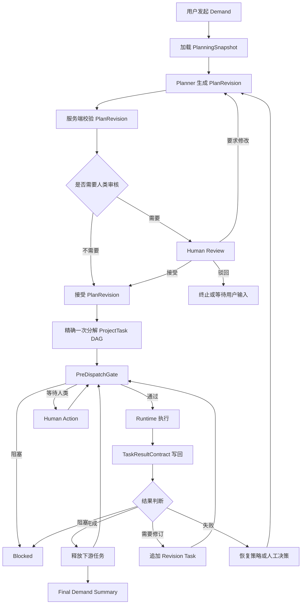

# 动态项目规划与数字员工编排 V1 设计

日期：2026-06-21
> 复核状态：06-21动态项目编排v1设计落地
状态：已确认，待实施计划
关联设计：

- `2026-06-14-project-coordination-dag-planner-design.md`
- `2026-06-20-project-task-durable-closure-design.md`
- `2026-06-21-execution-ledger-trace-design.md`

## 1. 背景

当前项目协调链路已经具备基础 DAG planner、ProjectTask 持久化、Runtime 分派和任务写回能力，但“用户提出一个真实业务任务后，系统如何生成可信 plan、选择合适数字员工、编排执行、联动人类确认并最终返回结果”仍缺少完整闭环。

现状里 planner 更像一次性 route decision：

- 输入里的数字员工候选信息偏薄，主要是成员 ID、角色、状态和显示名。
- 模型可以选择数字员工，但缺少稳定的能力画像、工具画像、权限画像、运行时画像和可靠性画像。
- 服务端会校验所选成员必须在活跃执行池里，但还没有可解释、可复核的能力匹配校验。
- 任务图可以落库和分派，但 plan revision、人工确认、精确一次分解、dispatch 前置闸门、结构化结果验收和 revision loop 仍需要统一设计。

这不是算法课里的 Dynamic Programming，而是动态任务规划、任务编排和多 Agent 调度能力。目标是让用户可以发起不同类型的任务，例如：

- 对数据库或业务数据进行分析；
- 对当前系统故障、告警、性能异常或用户反馈进行诊断；
- 对一个开发功能需求进行拆解、实现、验证和汇报；
- 对跨系统业务流程进行调查、补证、执行和验收。

系统需要先生成 plan，再选择和编排不同数字员工，调度循环执行，中间遇到高风险动作、歧义、权限不足、失败或验收节点时能暂停并联动人类交互，最后返回结构化结果和证据链。

## 2. 参考原则

本设计参考 Paperclip 和 HiClaw 的设计思想，但不照搬实现。

Paperclip 值得吸收的能力：

- 计划是可版本化、可审阅、可转换为任务图的业务对象；
- child issue / blocker / heartbeat / atomic checkout 用于稳定调度；
- accepted plan decomposition 必须精确一次，避免重试重复生成任务；
- agent 的执行结果需要结构化返回，失败、阻塞和 revision 都是正常状态。

HiClaw 值得吸收的能力：

- Manager 负责规划，Worker 负责执行，二者通过文件和状态对象协作；
- 每个任务有 spec、meta、result、state 等结构化文件；
- `.processing`、依赖、blocked、revision needed 等机制让任务可恢复；
- LLM 负责语义拆解，调度系统负责状态机、锁、审计和恢复。

SuperTeam 的落地原则：

- LLM 负责语义规划和解释，不负责最终可信调度。
- Control Plane 拥有 plan、task graph、状态机、权限、审批、审计和最终业务事实。
- Runtime Agent 只负责领取任务、执行 Provider、维护租约、日志、工件和结果写回。
- 数字员工是可调度执行身份；人类负责人、审核人和验收人是一等参与者，不建模成数字员工。

## 3. 目标

- 让用户发起的 demand 先形成可审阅、可版本化的 `PlanRevision`。
- 让 planner 基于稳定的数字员工能力画像选择执行员工，而不是只看角色名或 display name。
- 让服务端能独立验证 planner 的选择是否满足能力、权限、工具、运行时和负载约束。
- 让 accepted plan 通过精确一次机制转换为 ProjectTask DAG，避免 workflow retry 或人工重复点击造成重复任务。
- 在每次 Runtime 分派前执行 `PreDispatchGate`，提前发现缺权限、缺工具、Runtime 不可用、预算超限和人类确认需求。
- 让 Runtime 写回结构化 `TaskResultContract`，使 Control Plane 能自动判断完成、失败、阻塞、需要修订或需要人工复核。
- 支持任务级 revision、计划级 append-only replan、人工补证和最终总结。
- 让数据库分析、系统问题诊断和功能开发三类高价值任务具备可执行模板。

## 4. 非目标

- 不在 V1 引入 LangChain、CrewAI、AutoGPT 或类似第三方 agent 框架。
- 不把 planner 或调度策略放进 Runtime Agent。
- 不让数字员工绕过人类审批、权限策略或 Control Plane 校验。
- 不把人类负责人、审核人、验收人伪装成数字员工能力。
- 不在 V1 做全量 UI 工作台重构；Web 只按阶段暴露必要审核、状态和结果视图。
- 不在 V1 做部分 plan accept 或按任务选择性接受；V1 采用整版 plan 接受、驳回或要求修改。
- 不让 task dependency 依赖自由文本日志判断；依赖释放必须基于结构化结果。

## 5. 总体架构

动态规划闭环按以下链路执行：

关键边界：

- `PlanningSnapshot` 是 planner 的输入快照，不是长期事实源。
- `PlanRevision` 是计划版本和审核对象。
- `ProjectTask` 是 accepted plan 分解后的业务执行任务。
- `PreDispatchGate` 是任务真正交给 Runtime 前的最后 Control Plane 校验。
- `TaskResultContract` 是 Runtime/Provider 返回结果的结构化契约。
- `ProjectEvent`、approval、artifact、execution ledger 共同构成审计和验收证据。

## 6. 核心对象

### 6.1 DigitalEmployeePlanningProfile

数字员工规划画像是 planner 选择数字员工的主要依据。它不是新的“员工身份”，而是从已有数字员工、项目成员、技能、MCP、Runtime、权限、历史执行数据中构造的 planning read model。

建议字段：

| 字段 | 说明 |
| --- | --- |
| `digital_employee_id` | 数字员工 ID |
| `display_name` | 展示名 |
| `role_profile` | 角色画像，如 data analyst、backend engineer、incident investigator |
| `capabilities` | 能力标签，带来源和置信度 |
| `skills` | 可用 skill 或方法论能力 |
| `tool_bindings` | MCP、外部 capability、connector、provider 能力 |
| `runtime_requirements` | 需要的 Runtime 节点、工作区、Provider 类型 |
| `permissions` | 数据库读写、代码仓库、部署、外部系统访问等权限范围 |
| `context_policy` | 可接收的上下文类型和敏感数据边界 |
| `load_state` | 当前负载、执行槽位、可借调状态 |
| `reliability_signals` | 最近成功率、失败类型、超时、人工驳回情况 |
| `profile_freshness` | 画像生成时间和来源版本 |

画像必须支持 `unknown`，不能把缺失信息当作具备能力。

### 6.2 PlanningSnapshot

Planner 输入快照，包含：

- 项目目标、human owner、风险等级、预算和约束；
- 用户 demand 原文和结构化需求；
- 当前项目上下文、已有任务、依赖、历史结果和 artifacts 摘要；
- 候选数字员工 planning profiles；
- 可用 Runtime、Provider、MCP、外部 capability 摘要；
- policy 摘要，例如哪些动作需要人工审批；
- 当前已知阻塞、缺失上下文和可疑风险。

快照应控制体积，只注入 planning 需要的上下文切片。

### 6.3 PlanRevision

PlanRevision 是 planner 输出的版本化计划。它在被接受前不能分派 Runtime。

建议状态：

- `draft`
- `validation_failed`
- `pending_review`
- `accepted`
- `rejected`
- `superseded`
- `decomposing`
- `decomposed`

核心字段：

| 字段 | 说明 |
| --- | --- |
| `id` | 计划版本 ID |
| `project_id` | 项目 ID |
| `demand_id` | 用户需求或触发事件 ID |
| `revision_number` | 版本号 |
| `status` | 当前状态 |
| `payload` | 结构化计划内容 |
| `planner_model` | 使用的 planner/provider |
| `planner_input_hash` | 输入快照 hash |
| `plan_fingerprint` | 计划结构指纹 |
| `validation_errors` | 服务端校验错误 |
| `review_policy` | 是否需要人类 review 及原因 |
| `accepted_by` | 接受人或系统策略 |
| `accepted_at` | 接受时间 |

### 6.4 PlannedTask

PlannedTask 是 PlanRevision payload 中的任务定义，接受后转换为 ProjectTask。

建议字段：

| 字段 | 说明 |
| --- | --- |
| `planned_task_key` | plan 内稳定 key |
| `title` | 任务标题 |
| `objective` | 任务目标 |
| `task_type` | 数据分析、故障诊断、功能开发等开放类型 |
| `selected_employee_id` | planner 选择的数字员工 |
| `employee_selection_reason` | 选择原因 |
| `required_capabilities` | 必须能力 |
| `matched_capabilities` | 已匹配能力 |
| `missing_capabilities` | 缺失能力或 unknown |
| `permission_requirements` | 权限需求 |
| `tool_requirements` | 工具需求 |
| `runtime_requirements` | Runtime/Provider 需求 |
| `input_context_refs` | 输入上下文引用 |
| `expected_outputs` | 期望输出 |
| `acceptance_criteria` | 验收标准 |
| `verification_requirements` | 测试、查询、浏览器、日志或人工验收要求 |
| `depends_on` | 前置 planned task key |
| `human_review_required` | 是否需要人类确认 |
| `risk_level` | 风险等级 |

### 6.5 ProjectTask

ProjectTask 是执行事实源。它继承 PlannedTask 的契约，但拥有自己的状态机、attempt、Runtime 绑定、结果和审计。

PlanRevision 接受后，ProjectTask 必须保存：

- `accepted_plan_revision_id`
- `planned_task_key`
- `planner_metadata`
- employee 选择快照 hash
- capability match 摘要
- expected outputs
- acceptance criteria
- dependency graph
- risk and review policy

### 6.6 PreDispatchGate

PreDispatchGate 是任务从 `planned` 进入 `queued/running` 前的服务端校验结果。

建议状态：

- `passed`
- `waiting_human`
- `blocked`
- `retry_later`
- `replan_required`

检查项：

- 数字员工仍在项目执行池内；
- 数字员工 planning profile 未过期或变化仍可接受；
- 必须 capability 没有 hard missing；
- 权限、MCP、外部 capability、Runtime 节点、Provider 类型可用；
- 依赖任务已满足；
- 预算、并发、租约和执行槽位允许；
- 风险策略是否要求人工审批。

### 6.7 TaskResultContract

Runtime/Provider 完成任务后写回结构化结果，至少包含：

| 字段 | 说明 |
| --- | --- |
| `status` | `completed / revision_needed / blocked / failed / cancelled` |
| `summary` | 简短结论 |
| `acceptance_results` | 每条验收标准的结果 |
| `evidence_refs` | 证据引用 |
| `artifact_refs` | 工件引用 |
| `changes_made` | 代码、配置、数据或流程变更 |
| `verification` | 实际验证命令、接口、页面、查询或人工步骤 |
| `risks` | 剩余风险 |
| `follow_up_requests` | 需要后续处理的请求 |
| `human_review_request` | 如需人工判断，说明问题和选项 |
| `replan_request` | 如需重新规划，说明原因和约束 |

Control Plane 不能依赖自由文本日志释放下游任务。

## 7. 数字员工选择策略

V1 采用“模型语义规划 + 服务端确定性校验”的组合。

Planner 负责：

- 理解用户 demand；
- 拆分任务；
- 判断每个任务需要什么能力；
- 在候选数字员工中选择最合适执行者；
- 给出选择原因、匹配能力、缺失能力和风险。

服务端负责：

- 构造 planning profile；
- 计算 deterministic match score；
- 校验 hard requirements；
- 拒绝不在执行池、缺少硬能力、缺权限或 Runtime 不满足的选择；
- 决定是否需要人类 review；
- 保存选择依据用于审计。

建议评分权重：

| 维度 | 权重 | 说明 |
| --- | ---: | --- |
| capability / skill match | 40 | 是否满足任务关键能力 |
| role fit | 20 | 角色画像是否匹配任务类型 |
| runtime / workspace readiness | 15 | 执行环境、Provider、工作区是否可用 |
| permission / tool availability | 10 | 权限、MCP、外部工具是否满足 |
| current load | 10 | 当前负载和并发槽位 |
| recent reliability | 5 | 最近成功率、失败和人工驳回情况 |

硬性规则优先于分数。例如缺少数据库读权限的数字员工不能执行数据库分析任务；缺少代码仓库写权限的数字员工不能执行需要代码修改的功能开发任务。

## 8. 三类任务模板

### 8.1 数据库分析任务

典型阶段：

1. 明确分析目标和数据边界。
2. 选择具备数据库只读能力、SQL 能力和业务上下文能力的数字员工。
3. 如涉及敏感表或写操作，进入人工审批。
4. 执行查询和统计。
5. 形成结构化结论、SQL 摘要、证据和不确定性。

关键能力：

- database.read
- sql.analysis
- data.quality.check
- business.metric.interpretation
- sensitive.data.policy awareness

### 8.2 系统问题诊断任务

典型阶段：

1. 收集现象、时间范围、影响面和最近变更。
2. 分派日志、指标、代码路径、配置、依赖系统等分析任务。
3. 汇总根因假设。
4. 验证假设或请求补证。
5. 输出根因、缓解措施、修复建议和残余风险。

关键能力：

- incident.triage
- log.analysis
- metrics.analysis
- code.path.tracing
- runtime.provider.diagnostics
- risk.classification

### 8.3 功能开发任务

典型阶段：

1. 需求澄清和实现范围定义。
2. 代码影响分析。
3. 设计或实现计划 review。
4. 分派后端、前端、数据库、Runtime、测试等任务。
5. 执行验证、补证、代码 review 和最终汇报。

关键能力：

- codebase.analysis
- backend.implementation
- frontend.implementation
- database.migration
- contract.generation
- testing.verification
- documentation

高风险动作包括数据库迁移、生产写入、部署、删除数据、权限扩大和跨租户访问，必须通过人工确认。

## 9. 人类交互模型

人类决策是一等对象。V1 至少支持以下交互：

- `plan_review`：接受、驳回或要求修改计划；
- `clarification_request`：补充需求、上下文或限制；
- `permission_approval`：授权数据库、工具、外部系统或代码写权限；
- `risk_approval`：确认高风险操作是否允许继续；
- `result_review`：判断结果是否可接受；
- `replan_decision`：失败或需求变化后是否重新规划。

所有交互必须持久化：

- 请求原因；
- 关联 project、demand、plan revision、project task 或 attempt；
- 人类可选动作；
- 人类回复；
- 后续 continuation target。

数字员工不能代替 human owner 做最终业务判断。

## 10. 分阶段交付

本能力价值很大，但不适合一次性大改。因此采用一个完整总设计，拆成四个可独立实施的阶段。

### Phase 1：Planning Profile 与可解释选择

目标：

- 构造数字员工 planning profile；
- 扩展 planner input/output；
- 加入 deterministic scoring 和 validation；
- 让 plan 中的员工选择可解释、可审计、可拒绝。

详细设计见：

- `2026-06-21-dynamic-project-planning-orchestration-v1-phase-1-planning-profile.md`

### Phase 2：PlanRevision 与精确一次分解

目标：

- 引入版本化 PlanRevision；
- 支持人工 review；
- accepted revision 精确一次转换为 ProjectTask DAG；
- 保留旧任务 append-only 历史。

详细设计见：

- `2026-06-21-dynamic-project-planning-orchestration-v1-phase-2-plan-revision-decomposition.md`

### Phase 3：PreDispatchGate

目标：

- 在 ProjectTask 分派 Runtime 前统一校验；
- 对缺权限、缺工具、Runtime 不可用、预算超限和高风险动作提前阻塞或请求人工；
- 保证 gate 与 dispatch 幂等。

详细设计见：

- `2026-06-21-dynamic-project-planning-orchestration-v1-phase-3-predispatch-gate.md`

### Phase 4：Result Contract、Revision Loop 与最终总结

目标：

- 统一 Runtime 结构化结果；
- 根据结果自动释放依赖、创建 revision task、触发 replan 或等待人工；
- 生成最终 demand summary。

详细设计见：

- `2026-06-21-dynamic-project-planning-orchestration-v1-phase-4-result-contract-revision-loop.md`

## 11. 验证策略

每个阶段都有自己的单元测试、集成测试和必要 smoke。完整 V1 声称可用前，至少需要完成以下真实链路验证：

1. 用户提交数据库分析 demand。
2. Control Plane 生成 PlanRevision。
3. PlanRevision 展示选人原因和能力匹配依据。
4. 人类或策略接受指定 revision。
5. accepted revision 精确一次分解为 ProjectTask DAG。
6. root task 通过 PreDispatchGate。
7. Runtime 收到任务并执行真实 Provider。
8. Runtime 写回 TaskResultContract。
9. Control Plane 根据结构化结果释放下游任务。
10. 项目生成最终 summary，包含任务状态、证据和剩余风险。

后续还应补齐系统问题诊断和功能开发两类真实 smoke。

## 12. 风险与约束

- 规划过大：通过 phase spec 拆分执行，避免一次性大改。
- prompt 过大：planning profile 必须摘要化、限制候选数量、引用上下文切片。
- 分数误导：score 只用于排序和解释，hard gate 才决定能否执行。
- 人工审核过载：policy 需要区分低风险自动接受和高风险强制 review。
- 重试重复建任务：accepted revision fingerprint 和 decomposition claim 必须落库。
- Runtime 失败被误判为 planner 失败：PreDispatchGate 只判断已知前置条件，Provider 运行失败仍由 Runtime result 表达。
- 历史改写：所有 revision、任务和结果采用 append-only，不能改写已执行事实。

## 13. 实施顺序建议

建议按四阶段顺序实现，不建议把 Phase 1、2、3、4 合并成一个开发任务。

原因：

- Phase 1 改 planner 输入输出和 validation，是能力选择准确性的基础。
- Phase 2 改计划事实源和分解幂等，涉及数据库、workflow 和 review。
- Phase 3 改 dispatch 入口，影响 Runtime 分派安全性。
- Phase 4 改结果写回和循环推进，影响任务完成、依赖释放和最终验收。

四个阶段必须共用本总设计，避免只做第一阶段后忘记后续闭环。
