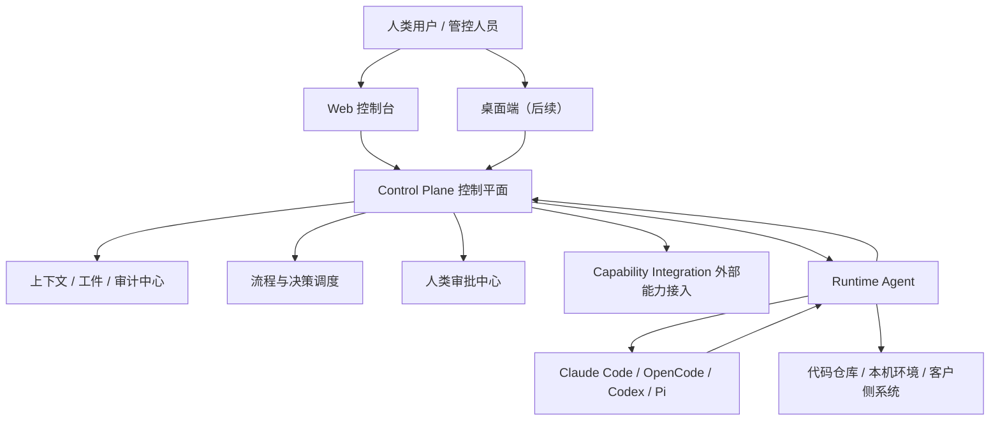
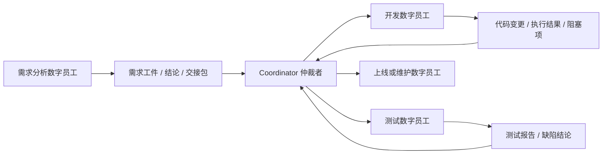
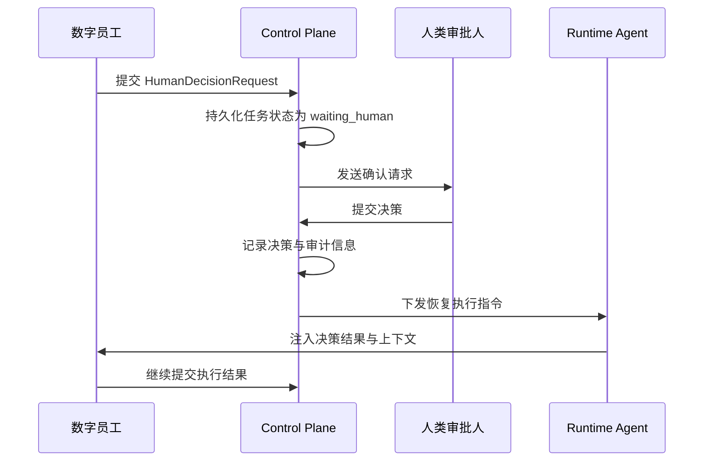
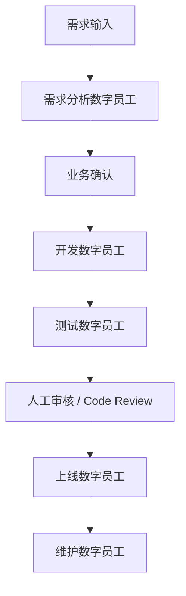

# Super Team 数字员工平台技术方案

日期：2026-05-26

## 1. 文档定位

本文档用于沉淀 Super Team 数字员工平台的整体技术方案，重点回答四个问题：

1. 为什么要做这个平台。
2. 这个平台能带来什么价值。
3. 平台应该如何分阶段建设。
4. 项目的整体技术选型、架构边界和目录设计应该如何规划。

本文不展开具体接口字段、数据库表结构、提示词模板、代码实现细节。它定义的是产品级和架构级边界，后续可以在此基础上拆分为 PRD、技术设计、开发计划和实施规范。

## 2. 背景与核心问题

企业已经开始使用 Claude Code、OpenCode、Codex、Pi 等 AI 编程或智能体工具，但它们多数仍停留在“单人本地增强工具”的阶段。真实企业交付场景里，需要解决的问题更复杂：

- 一个需求通常要经过需求分析、方案设计、开发、测试、上线、维护等多个阶段。
- 不同阶段需要不同能力的数字员工参与，而不是让一个通用 AI 从头做到尾。
- 企业内部的数据结构、接口、系统、审批流程各不相同，不能把每个客户都写成一套硬编码逻辑。
- 关键操作需要人类确认，系统必须能够暂停、等待审批、恢复执行。
- 执行过程需要可追踪、可审计、可复盘，而不是只留下几段聊天记录。
- 企业可能同时接入多个 AI 执行工具，平台不能绑定到某一个供应商或某一个命令行工具。

所以，Super Team 要做的不是另一个 Claude Code 插件，也不是简单的多 Agent 聊天室，而是一个企业级数字员工控制平面：把 AI 执行能力、外部企业能力、流程调度、人类审批、上下文管理、审计追踪统一组织起来。

## 3. 建设目标

Super Team 的目标是打造一个可以被企业采用的数字员工平台，让企业能够以“团队”的方式组织 AI 能力。

核心目标包括：

- 数字员工可定义：每个数字员工拥有角色、技能、工具权限、外部能力、执行器偏好和工作边界。
- 流程可编排：从需求分析到开发、测试、上线、维护，可以由多个数字员工协作完成。
- 信息可结构化传递：数字员工之间不依赖自由聊天，而是通过工件、结论、交接包、审批请求等结构化对象传递。
- 人类可介入：遇到不确定、风险高、权限不足或需要确认的节点时，流程暂停并等待人类决策。
- 企业可标准化接入：不同客户的数据、接口、流程通过连接器、语义映射和能力注册表接入，而不是侵入核心系统。
- 执行器可替换：Claude Code、OpenCode、Codex、Pi 等工具都只是 Runtime Provider，可以按任务、客户、成本、权限动态选择。
- 过程可审计：所有任务、决策、执行结果、上下文变更、审批记录都有持久化记录。

## 4. 平台价值

### 4.1 对企业的价值

- 提高研发交付效率：把需求分析、代码开发、测试修复、文档更新等重复工作拆给不同数字员工处理。
- 降低 AI 使用风险：通过权限、审批、审计、回滚策略约束 AI 的执行边界。
- 沉淀组织过程资产：需求结论、技术方案、测试结论、上线记录都变成可复用的结构化资产。
- 统一多工具使用体验：企业不需要分别管理 Claude Code、OpenCode、Codex、Pi 等工具的使用方式。
- 支持多客户差异化接入：每个客户可以有自己的连接器、外部能力、数据映射、流程模板和审批规则，但平台核心保持一致。

### 4.2 对乙方交付团队的价值

- 标准化交付方法：把每个客户项目中的需求澄清、开发、测试、上线流程抽象成可复用模板。
- 降低项目切换成本：不同客户差异通过租户配置、连接器、映射层隔离，减少重复开发。
- 保留交付证据：每次 AI 执行、人工确认、代码变更、测试结论都可回溯。
- 更容易规模化：不是依赖某个工程师记住客户细节，而是把客户上下文沉淀到平台。

### 4.3 对使用者的价值

- 管理者看到的是任务、风险、审批、进度、产出。
- 产品或业务人员看到的是需求澄清、确认点、验收结论。
- 工程师看到的是代码任务、执行日志、失败原因、可复用上下文。
- 运维或维护人员看到的是事件、诊断结论、执行建议、人工审批记录。

## 5. 核心设计原则

### 5.1 控制平面与执行平面分离

控制平面负责组织、调度、记录和治理；执行平面负责真正调用 Claude Code、OpenCode、Codex、Pi、脚本或企业系统。

这样可以避免平台被某个执行工具绑定，也方便在不同客户环境中部署 Runtime Agent。

### 5.2 数字员工不是聊天机器人

数字员工应该被看作“带角色、权限、技能和执行能力的工作单元”。它可以和人类对话，但它的核心不是聊天，而是完成有输入、有输出、有约束、有责任边界的任务。

### 5.3 Agent 之间不直接自由聊天

不同数字员工之间通过结构化数据交换，不建议互相自由对话。自由对话会导致上下文不可控、责任边界不清、审计困难。

推荐模式是：

- 数字员工读取任务上下文。
- 数字员工产出结构化工件和结论。
- Coordinator 根据结构化结果判断下一步。
- 必要时进入人类审批或人工确认。

### 5.4 人类始终拥有关键决策权

平台不是全自动黑盒。高风险动作、业务确认、权限不足、不确定结论、上线发布等环节必须能暂停并等待人类确认。

### 5.5 多企业差异通过配置和适配层解决

不同客户的数据库、接口、流程、权限、术语都不一样。平台核心不应该包含客户专属逻辑，而应该通过 Tenant Profile、Connector、Semantic Mapping、Capability 配置和 Policy 来适配。

### 5.6 先做可控闭环，再做智能自组织

初期不追求完全自组织的 Agent 群体。先建立稳定的任务、上下文、审批、执行、审计闭环，再逐步提升自动路由和自动决策能力。

## 6. 总体架构

Super Team 建议采用“Console Layer + Control Plane Layer + Runtime Layer + Provider Layer + Capability Integration Layer”的架构。



### 6.1 Console Layer 控制台层

Console Layer 第一阶段只实现 Web 控制台主链路。桌面端只保留空壳或占位，暂不做业务适配；待 Web 主链路完整后，再作为原生壳承载通知和快速查看。

Web 控制台面向企业管理、项目协作和流程治理，主要能力包括：

- 项目和工作区管理。
- 数字员工配置。
- 流程模板管理。
- 任务看板。
- 人类审批中心。
- 执行过程查看。
- 工件、结论、测试报告、上线记录查看。
- 租户级能力配置。

Desktop 是 Web 控制台的后续桌面形态。当前阶段不实现桌面端业务功能，不要求 Web 页面同步适配 Desktop；未来 Web 主链路稳定后，再复用共享页面，补齐原生消息通知、托盘入口和免打开浏览器的快速查看。Desktop 不承担本机执行能力。

### 6.2 Control Plane 控制平面

控制平面是平台大脑，负责：

- 租户、项目、成员、权限管理。
- 数字员工定义与版本管理。
- 技能包、外部能力、Provider 能力注册。
- 任务生命周期管理。
- 工作流调度、决策节点、暂停恢复。
- 全局上下文、工件、结构化消息存储。
- 人类审批与确认机制。
- 审计、日志、风险记录。
- Runtime Agent 注册、心跳、任务分发和状态回收。

控制平面不直接执行本地命令，不直接操作客户侧代码仓库。它只负责下发任务和接收结果。

### 6.3 Runtime Agent

Runtime Agent 部署在各个服务器节点、开发者机器、客户侧服务器或专用执行机器上。它是控制平面和实际执行工具之间的桥。

主要职责：

- 注册到控制平面并维持心跳。
- 领取任务并保持租约。
- 管理本机并发执行槽位。
- 启动和管理 Claude Code、OpenCode、Codex、Pi 等 Provider 会话。
- 访问本地仓库、终端、文件系统和客户侧网络。
- 回传执行事件、日志、工件、失败原因。
- 在需要人工确认时停止执行并等待控制平面恢复任务。

Runtime Agent 只负责节点执行，不负责业务策略、人类审批策略和长期业务状态。

### 6.4 Provider 执行器

Provider 是真正完成任务的 AI 执行工具或执行环境，包括：

- Claude Code。
- OpenCode。
- Codex。
- Pi。
- 未来可能接入的其他 coding agent、脚本执行器、测试执行器、部署执行器。

Provider 不应该拥有平台级状态。它只在 Runtime Agent 的管理下执行某个任务片段。

### 6.5 Capability Integration 外部能力接入

Capability Integration 用于接入客户内部系统和外部服务，例如：

- 需求系统。
- 代码仓库。
- CI/CD。
- 数据库。
- 日志平台。
- 监控系统。
- 工单系统。
- 文档知识库。
- 权限审批系统。

这些能力需要通过统一注册、授权、HTTP 调用、审计和语义映射后暴露给数字员工。平台只管理外部能力的调用契约、权限边界和审计记录，不把外部能力实现放入控制平面核心。

## 7. 核心对象模型

平台应围绕以下核心对象构建，而不是围绕聊天会话构建。

### 7.1 Tenant 租户

代表一个企业客户或一个独立组织。租户拥有自己的成员、项目、数据连接器、外部能力配置、审批策略和隔离边界。

### 7.2 Workspace 工作区

代表一个客户内的业务域或项目集合，例如某个系统、某条产品线、某个交付项目。

### 7.3 Project 项目

代表具体交付目标，例如一次功能迭代、一个系统维护任务、一个故障处理任务。

### 7.4 Digital Employee 数字员工

数字员工由以下部分组成：

- 角色定位：需求分析、架构设计、开发、测试、上线、维护、故障诊断等。
- 技能集合：处理任务所需的方法、流程、提示词、规范和操作经验。
- 工具权限：允许调用哪些外部能力、Provider、仓库、系统。
- 上下文策略：能读取哪些项目资料、历史记录和客户知识。
- 输出契约：必须产出什么类型的结构化结果。
- 风险等级：哪些动作必须等待人工确认。

### 7.5 Skill 技能

技能是数字员工的能力单元，可以包含：

- 工作方法。
- 检查清单。
- 输出格式。
- 可调用工具说明。
- 领域知识。
- 流程约束。

技能应该可装载、可卸载、可版本化，并且可以按数字员工、租户、项目、任务动态组合。

### 7.6 Capability 能力

Capability 是平台可调用的外部能力，包括企业接口、HTTP API、外部服务、Provider 能力、本地脚本、测试命令、部署动作等。

### 7.7 Task 任务

任务是平台调度的基本单元。任务可以处于排队、执行、等待人工、等待审批、完成、失败、阻塞、取消、交接就绪等状态。

### 7.8 Artifact 工件

工件是数字员工产出的可持久化结果，例如：

- 需求分析文档。
- 技术方案。
- 代码变更摘要。
- 测试报告。
- 上线计划。
- 故障分析结论。
- 风险清单。

### 7.9 Handoff 交接包

交接包用于把一个阶段的结果传给下一个阶段。它应该包含：

- 上一阶段目标。
- 已确认事实。
- 未解决问题。
- 关键约束。
- 产出工件。
- 下一阶段建议。
- 是否需要人类确认。

### 7.10 Human Decision 人类决策

人类决策是流程暂停和恢复的关键对象。它记录：

- 谁发起确认。
- 为什么需要确认。
- 等待谁确认。
- 可选决策是什么。
- 人类最终选择了什么。
- 决策后恢复到哪个流程节点。

## 8. 数字员工协作机制

### 8.1 推荐协作方式

平台不建议让数字员工之间直接互相发自然语言消息，而建议采用“Coordinator + 结构化状态”的协作方式。



Coordinator 的职责不是替代所有数字员工，而是负责判断：

- 当前信息是否足够进入下一阶段。
- 应该调用哪个数字员工。
- 是否需要补充上下文。
- 是否需要人类审批。
- 是否应该结束流程并输出结论。
- 是否应该回退到前一阶段。

### 8.2 信息传递方式

数字员工之间传递的不是“聊天内容”，而是以下结构化对象：

- Finding：事实、观察、诊断结论。
- Artifact：阶段性产物。
- Handoff：交接包。
- Blocker：阻塞原因。
- DecisionRequest：请求人类做决定。
- ExecutionResult：执行结果。
- Risk：风险说明。
- NextActionProposal：下一步建议。

这种方式能保证信息可验证、可审计、可复用。

### 8.3 全局上下文与局部上下文

平台需要维护一个全局上下文，但执行时不能把所有信息无差别塞给每个 Provider。

推荐方式：

- 全局上下文由控制平面持久化。
- 每个任务节点只注入与当前目标相关的上下文切片。
- 数字员工只读取自己权限范围内的信息。
- 重要结论必须回写成结构化记录，而不是只存在模型上下文里。

## 9. 人类与数字员工融合机制

### 9.1 什么时候需要人类介入

以下情况应该触发人类确认：

- 需求存在歧义，需要业务确认。
- 技术方案涉及明显取舍。
- 要访问高敏感数据或系统。
- 要执行写入、删除、部署、回滚等高风险动作。
- Provider 判断条件不满足，无法继续执行。
- 测试失败但是否继续存在业务判断。
- 任务越权或超出数字员工职责边界。

### 9.2 暂停与恢复机制

人类介入不应该是“发一条消息等回复”这么简单，而应该是流程状态机的一部分。



关键点：

- 暂停时必须保存当前任务状态、上下文、工件、执行位置和等待原因。
- 人类决策必须结构化记录。
- 恢复时不是恢复原来的模型上下文，而是重新构造当前节点所需上下文并继续执行。
- 如果超时未确认，应进入升级、取消、转人工处理或继续等待策略。

### 9.3 决策节点的定位

决策节点不是普通 if/else，也不是简单审批按钮。它应该是平台内的一等对象，具有：

- 触发条件。
- 决策类型。
- 审批人或审批角色。
- 可选动作。
- 超时策略。
- 审计记录。
- 恢复目标。

这样才能让流程真正做到可暂停、可恢复、可追踪。

## 10. 从需求到上线的端到端流程

Super Team 可以支持从需求分析到上线维护的完整流程，但初期应该以“可控闭环”为目标。



### 10.1 需求分析阶段

目标是把自然语言需求转成可执行的需求工件。

典型输出：

- 需求背景。
- 用户目标。
- 功能范围。
- 非功能约束。
- 验收标准。
- 未确认问题。
- 风险点。
- 交接给开发阶段的 Handoff。

### 10.2 开发阶段

目标是根据已确认需求完成代码变更。

典型输出：

- 代码变更摘要。
- 影响范围。
- 本地验证结果。
- 未解决问题。
- 需要人类确认的风险。
- 交接给测试阶段的 Handoff。

### 10.3 测试阶段

目标是验证变更是否满足需求。

典型输出：

- 测试计划。
- 自动化测试结果。
- 手工验证建议。
- 缺陷列表。
- 是否可进入上线阶段的结论。

### 10.4 上线阶段

目标是执行或辅助执行发布动作。

典型输出：

- 上线计划。
- 回滚方案。
- 发布检查清单。
- 发布结果。
- 异常记录。

### 10.5 维护阶段

目标是处理线上问题、运行状态、告警和后续优化。

典型输出：

- 故障诊断结论。
- 影响范围。
- 处置建议。
- 是否需要人工执行高风险操作。
- 复盘工件。

## 11. 多企业标准化接入方案

用户作为乙方接入多个企业时，最关键的问题不是“怎么写更多 Agent”，而是怎么把客户差异隔离在平台边界之外。

### 11.1 标准化分层

建议采用五层标准化：

1. Tenant Profile：定义客户组织、术语、权限、流程偏好。
2. Connector：对接客户具体系统。
3. Semantic Mapping：把客户字段、接口、状态映射为平台统一语义。
4. Capability Registry：登记数字员工可调用的能力。
5. Policy：定义哪些动作允许自动执行，哪些必须人工确认。

### 11.2 客户差异的处理方式

客户差异不进入核心流程代码，而进入配置和适配层。

示例：

- 客户 A 的需求系统叫 Jira，客户 B 的需求系统是自研系统。
- 平台内部都抽象成 Requirement Source。
- Connector 负责读取原始数据。
- Semantic Mapping 负责转成平台统一需求对象。
- 数字员工只处理统一对象，不直接理解客户系统细节。

### 11.3 Capability 的角色

Capability 是平台对外部能力的统一抽象。外部能力可以来自客户系统、HTTP API、脚本服务和第三方平台。平台本身不把外部能力实现作为内部架构层。

平台需要负责：

- 外部能力注册。
- 外部能力权限控制。
- 外部能力调用审计。
- 外部能力输入输出标准化。
- 外部能力与数字员工角色的授权关系。
- 外部能力在不同租户下的隔离。
- 通过 HTTP Connector 调用外部能力。

## 12. 技术选型建议

### 12.1 总体推荐

| 模块 | 推荐选型 | 原因 |
| --- | --- | --- |
| Web 控制台 | Next.js | 适合构建管理后台、协作界面、服务端渲染和 API 聚合 |
| 桌面端 | Tauri + React/Vite | 第一阶段仅保留空壳或占位；Web 主链路完整后再承载通知、快速查看和免浏览器访问 |
| 共享 UI | packages/views + packages/ui | 第一阶段重点服务 Web；后续让 Desktop 复用稳定后的业务页面 |
| 控制平面后端 | Go + chi/net/http | 与 Runtime Agent 技术栈一致，适合任务调度、节点管理和长期运行服务 |
| API 契约 | REST/OpenAPI + oapi-codegen | 简单、通用、易调试，适合 Console 和 Runtime Agent 共同接入 |
| Runtime Agent | Go | 进程管理、网络通信、跨平台部署、并发模型和迭代效率更均衡 |
| 工作流调度 | Temporal | 第一阶段就引入，承接长流程、暂停恢复、重试、超时和补偿 |
| 数据库 | PostgreSQL | 适合作为任务、上下文、工件、审计、租户配置的主存储 |
| 缓存与事件 | Redis + WebSocket | Redis 适合缓存、唤醒和轻量队列；WebSocket 用于 Runtime 实时事件回传，NATS 后续按多节点事件总线需要再引入 |
| 对象存储 | S3 兼容存储 / 本地存储 | 保存日志、报告、附件、执行产物 |
| Provider | Claude Code / OpenCode / Codex / Pi | 作为 Runtime Provider 接入，不作为控制平面核心；优先走统一 provider contract，必要时用 CLI、PTY 或 HTTP adapter 兜底 |

### 12.2 为什么不把 OpenCode 作为平台核心

OpenCode 可以作为优秀的执行 Provider，但不适合作为整个控制平面的核心，原因是：

- 它主要解决 coding agent 执行问题，不负责企业级租户、审批、审计、流程治理。
- 它不天然解决多数字员工协作和跨阶段交接。
- 它不应承载客户差异化接入、外部能力治理和组织级上下文管理。
- 绑定 OpenCode 会降低平台对 Claude Code、Codex、Pi 等其他执行器的兼容性。

因此，OpenCode 应该被 Runtime Agent 调用，而不是反过来让平台依附于 OpenCode。

### 12.3 LangGraph 的定位

LangGraph 可以用于表达 Agent 流程、状态图、条件跳转和人工中断恢复。但在 Super Team 中，第一阶段以 Temporal 承接长流程、暂停恢复、重试、超时和补偿；LangGraph 不作为初期核心技术选型。

合理定位：

- 后续用于复杂 Agent 流程实验。
- 后续用于节点状态和条件路由的局部探索。
- 必须与平台的任务状态、审批中心、审计系统对接。

不建议让 LangGraph 直接承担：

- 租户管理。
- 权限治理。
- Runtime Agent 调度。
- Provider 生命周期管理。
- 企业连接器管理。
- 全局工件与审计中心。

### 12.4 Pi 的定位

Pi 可以作为一个值得研究和接入的 Agent 执行层或技能运行层，但初期不建议把 Pi 作为唯一底座。

更稳妥的方式是：

- 把 Pi 放在 Provider 或 Execution Engine 层。
- 让 Runtime Agent 管理 Pi 的启动、输入、输出和结果回收。
- 用控制平面统一承接状态、权限、审批和上下文。

这样即使未来替换或升级 Pi，也不会影响平台核心架构。

### 12.5 Tauri 与 Next.js 的关系

建议采用 Web 优先、Desktop 后置的策略：

- 第一阶段只实现 Web 控制台主链路。
- Desktop 只保留空壳或占位，不做业务适配。
- Web 主链路稳定后，再将稳定页面、组件、状态逻辑沉淀到共享包，供 Desktop 复用。
- Desktop 后续使用 Tauri 承载桌面壳、通知中心和快速查看。
- 平台差异通过 Adapter 处理。

不建议在第一阶段强行同时适配 Web 和 Desktop。否则会提前引入路由、通知、窗口、打包和平台差异成本，影响 Web 主链路验证。

## 13. Runtime Agent 技术边界

Runtime Agent 是整个系统中最接近执行环境的组件。它应该强边界、低耦合、可替换。

### 13.1 Runtime Agent 负责什么

- 注册和心跳。
- 任务领取。
- 租约续期。
- 本机执行槽位管理。
- Provider 会话管理。
- 日志和事件回传。
- 工件上传。
- 失败原因归类。
- 本机权限和目录授权。

### 13.2 Runtime Agent 不负责什么

- 不负责决定企业流程。
- 不负责保存长期业务状态。
- 不负责跨租户数据管理。
- 不负责人类审批策略。
- 不负责解释所有业务语义。

这些应该留在控制平面。

### 13.3 多 Provider 实例管理

同一台 Runtime Agent 主机可能同时启动多个 Claude Code、OpenCode 或 Codex 会话。平台需要从一开始就把执行会话看作独立资源。

建议抽象为：

- Runtime Host：一台执行机器。
- Runtime Agent：机器上的守护进程。
- Execution Slot：可并发执行的槽位。
- Provider Session：某个工具的一次执行会话。
- Task Lease：任务执行租约。

这样可以控制并发、隔离项目目录、避免多个 AI 实例互相干扰。

## 14. 消息通信方案

### 14.1 Control Plane 与 Runtime Agent

推荐采用“控制平面持久化任务 + Runtime Agent 主动领取 + 实时通道唤醒”的模式。

基本机制：

- Control Plane 保存任务。
- Runtime Agent 注册能力和可用状态。
- Runtime Agent 主动 claim 任务。
- 任务执行期间维持 lease 和 heartbeat。
- 实时事件第一阶段通过 WebSocket 回传；NATS 后续在多节点事件总线需要时再引入。
- 任务完成后提交 ExecutionResult 和 Artifact。

这种模式比控制平面直接远程命令 Runtime Agent 更稳，因为客户侧网络、NAT、防火墙和离线状态都更容易处理。

### 14.2 Agent 与 Agent

Agent 与 Agent 之间不直接通信。所有信息通过控制平面的结构化对象中转：

- 工件进入 Artifact Store。
- 结论进入 Finding Store。
- 阻塞进入 Blocker。
- 交接进入 Handoff。
- 决策进入 Decision Center。

Coordinator 读取这些对象后决定下一步。

### 14.3 人类与 Agent

人类不直接进入 Provider 会话里修改上下文，而是通过平台提交结构化决策。

这样可以保证：

- 决策可审计。
- 恢复点明确。
- 不同人类角色的权限可控。
- 决策结果能被后续数字员工复用。

## 15. 项目架构目录设计

建议采用 monorepo，保持 Web、Desktop、Control Plane、Runtime Agent 和共享包在一个仓库内统一演进。

```text
super-team/
  apps/
    web/
      # Next.js Web 控制台
    desktop/
      # 第一阶段仅空壳或占位，后续承载通知中心和快速访问
    control-plane/
      # Control Plane Go 服务
      cmd/control-plane/
      internal/
        api/
          # REST/OpenAPI 路由、请求响应适配
        auth/
          # 登录、会话、访问控制入口
        tenant/
          # 租户、成员、工作区
        employee/
          # 数字员工定义、技能绑定、权限边界
        task/
          # 任务生命周期、状态流转
        workflow/
          # 流程模板、Temporal 调度、节点状态
        approval/
          # 人类审批、暂停/恢复
        runtime/
          # Runtime Agent 注册、心跳、claim、lease
        artifact/
          # 工件、日志、报告
        audit/
          # 审计事件、操作记录
        capability/
          # 外部能力注册、授权、HTTP 调用
        policy/
          # 风险策略、审批策略、权限判断
        storage/
          # DB、Redis、S3 封装
        config/
          # 配置加载
    runtime-agent/
      # Go Runtime Agent
      cmd/runtime-agent/
      internal/
        daemon/
          # Runtime Agent 进程生命周期、启动/停止、主循环
        controlplane/
          # 调用 Control Plane 的客户端
        lease/
          # claim、renew、heartbeat、任务租约
        slots/
          # 本机并发执行槽位
        providers/
          # Claude Code / OpenCode / Codex 适配
        workspace/
          # 本机工作目录、仓库、文件权限
        events/
          # 日志、状态、执行事件回传
        artifact/
          # 工件收集、上传
        config/
          # 节点配置
        secrets/
          # 本机密钥读取和脱敏
        health/
          # 节点健康检查、环境探测

  packages/
    ui/
      # 纯 UI 组件，不含业务逻辑
    views/
      # 共享业务页面；第一阶段可先服务 Web，后续再给 Desktop 复用
    core/
      # 领域模型、状态、权限、schema 和领域 hooks
    api-client/
      # 生成客户端、请求封装和 API 类型

  contracts/
    control-plane/
      # Console <-> Control Plane REST/OpenAPI 契约
    runtime/
      # Runtime Agent <-> Control Plane HTTP/WS 契约
    provider/
      # Runtime Agent <-> Provider 契约

  connectors/
    http/
      # 通用 HTTP 外部能力接入
    custom/
      # 客户专属连接器放在隔离目录或独立包中

  skills/
    requirement-analyst/
    architect/
    developer/
    tester/
    release-manager/
    maintainer/
      # 数字员工技能包

  workflows/
    requirement-to-release/
    incident-response/
    code-review/
      # 可版本化的流程模板

  docs/
    # 产品方案、架构方案、设计文档、实施指南

  deploy/
    local/
    cloud/
    customer-side/
      # 本地、云端、客户侧部署配置
```

### 15.1 目录边界说明

- `apps/web` 只承载 Web 入口，不沉淀核心业务逻辑。
- `apps/desktop` 第一阶段仅保留空壳或占位，不做业务适配；后续只承载桌面壳、通知中心和快速访问，不承担本机执行能力。
- `apps/control-plane` 承载平台后端，按领域能力分包，负责 API、任务、审批、审计、调度、Runtime 管理和外部能力注册。
- `apps/runtime-agent` 是独立可部署进程，不依赖前端代码，只负责节点执行。
- `packages/views` 第一阶段可先服务 Web；Web 主链路稳定后，再让 Desktop 复用主要功能页面。
- `packages/core` 保持领域模型、状态、权限、schema 和领域 hooks，不放 UI，不放浏览器或桌面特有 API。
- `packages/api-client` 只负责 API 访问、生成客户端、请求封装和 API 类型。
- `contracts` 是跨语言协议和 API 契约的唯一来源。
- `skills` 保存可版本化、可组合的数字员工能力。
- `connectors` 隔离客户和第三方系统差异，具体外部系统或 HTTP 能力适配实现放在这里。
- `workflows` 保存流程模板，不与具体客户硬绑定。

## 16. 分阶段建设路线

### 16.1 阶段一：MVP 可控闭环

目标：证明平台可以完成“人类输入需求 -> 数字员工分析 -> 人类确认 -> Runtime Agent 执行 -> 回传结果和工件 -> 人类验收”的最小闭环。

范围：

- 控制平面基础模型。
- Web 控制台基础任务看板。
- 桌面端仅保留空壳或占位，不进入 MVP 主链路。
- Runtime Agent 注册、心跳、任务领取。
- 接入一个 Provider，优先 Claude Code 或 OpenCode。
- 一个需求分析数字员工。
- 一个可执行开发任务的 Runtime Provider Adapter。
- 人类确认节点。
- 工件和执行日志存储。

阶段成果：

- 能跑通一个真实代码任务。
- 能暂停等待人类确认。
- 能从确认点恢复。
- 能看到完整执行记录。

### 16.2 阶段二：多数字员工协作

目标：让需求、开发、测试三个数字员工通过结构化交接完成协作。

范围：

- Coordinator 仲裁逻辑。
- Handoff 交接包。
- Finding、Blocker、ExecutionResult 等结构化对象。
- 测试数字员工。
- 流程模板版本管理。
- 上下文切片注入。
- Provider 选择策略。

阶段成果：

- 从需求分析到测试验证形成稳定流程。
- 数字员工之间不靠聊天，而靠结构化工件协作。
- 人类能看到每个阶段的输入、输出和判断依据。

### 16.3 阶段三：多企业接入

目标：支持多个客户的系统、流程、数据结构差异。

范围：

- Tenant Profile。
- Connector 框架。
- Semantic Mapping。
- 外部能力注册和授权。
- 客户级流程模板。
- 客户级审批策略。
- 多租户审计隔离。

阶段成果：

- 至少接入两个差异明显的客户环境。
- 平台核心不需要为客户单独改代码。
- 客户差异通过配置、连接器和映射层解决。

### 16.4 阶段四：企业级治理

目标：让平台具备企业生产可用能力。

范围：

- 完整权限体系。
- 审批流升级。
- 操作风险分级。
- 审计报表。
- Runtime Agent 资源治理。
- 多 Provider 策略。
- 成本统计。
- 失败重试与补偿机制。
- 安全策略和密钥治理。

阶段成果：

- 能被企业团队长期使用。
- 能控制 AI 执行风险。
- 能追踪每一次关键决策和执行。

### 16.5 阶段五：智能化调度

目标：在稳定治理基础上提升自动路由和自组织能力。

范围：

- Coordinator 策略优化。
- 基于历史结果的任务路由。
- 数字员工能力评分。
- 自动选择 Provider。
- 自动推荐技能包。
- 基于组织知识的上下文召回。

阶段成果：

- 系统能根据任务类型自动推荐数字员工和流程。
- 数字员工能力可以持续评估和改进。
- 人类从执行者逐渐转向监督者和决策者。

## 17. MVP 推荐范围

初期不要同时做完整平台。建议 MVP 只聚焦一条最有价值的链路：

需求分析数字员工 -> 人类确认 -> Runtime Agent 调用 Provider -> 回传结果和工件 -> 人类验收。

MVP 必须包含：

- 一个 Web 控制台雏形；桌面端仅保留空壳或占位。
- 一个 Runtime Agent。
- 一个 Provider Adapter。
- 一个需求分析技能。
- 一个结构化 Handoff。
- 一个 HumanDecisionRequest。
- 一个 Artifact Store。
- 一个可查看的任务时间线。

MVP 暂时不包含：

- 完整多租户商业化。
- 大量客户连接器。
- 复杂自动部署。
- 完整权限矩阵。
- 完整成本系统。
- 完整 Agent 自组织。

先把“可控、可暂停、可恢复、可审计”的闭环跑通，再扩展能力。

## 18. 关键风险与取舍

### 18.1 过早追求全自动

风险：系统不可控，结果难以审计，人类不敢使用。

建议：先建立明确审批点和结构化交接，再逐步提高自动化程度。

### 18.2 过早绑定某个 Provider

风险：平台被 Claude Code、OpenCode、Codex 或 Pi 的能力边界限制。

建议：Provider 统一放到 Runtime Agent 管理，平台核心只认统一执行协议和结构化结果。

### 18.3 多客户差异侵入核心系统

风险：每接一个客户都改核心代码，后期无法维护。

建议：客户差异必须进入 Connector、Semantic Mapping、Policy 和 Tenant Profile。

### 18.4 上下文无限膨胀

风险：模型输入不可控、成本上升、结论混乱。

建议：全局上下文持久化，执行时只注入相关切片，并要求关键结论结构化回写。

### 18.5 流程编排过重

风险：早期研发速度变慢，团队被框架约束。

建议：第一阶段就使用 Temporal，但只承载必要的暂停恢复、重试、超时和补偿，避免过早设计复杂自组织流程。

## 19. 成功标准

平台早期是否成功，不应该只看模型回答是否聪明，而应该看以下指标：

- 一个需求是否能被转成清晰、可确认、可开发的结构化需求。
- 开发数字员工是否能基于交接包完成代码任务。
- 测试数字员工是否能给出可验证的测试结论。
- 人类确认节点是否能稳定暂停和恢复流程。
- 每个阶段的输入、输出、决策和工件是否可追踪。
- 客户差异是否能通过配置和连接器处理，而不是改核心代码。
- Runtime Agent 是否能稳定管理多个 Provider 会话。
- Web 主链路是否完整；Desktop 后续复用时是否不需要重写业务逻辑。

## 20. 最终判断

Super Team 的核心定位应该是“企业级数字员工控制平面”，而不是某个 AI 编程工具的外壳。

它的长期价值来自三件事：

1. 把 AI 执行能力组织成可管理的数字员工团队。
2. 把企业流程、人类审批、上下文、工件和审计纳入统一控制平面。
3. 把客户差异隔离在连接器、映射层和策略层，使平台可以规模化复制。

按照这个方向建设，Super Team 可以逐步达到从需求分析、代码开发、测试验证、上线发布到后续维护的完整流程协作。但第一阶段必须克制，先完成一条稳定闭环，再扩展为完整企业级平台。
